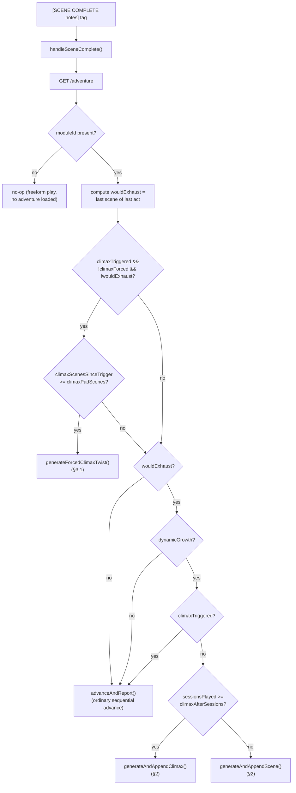
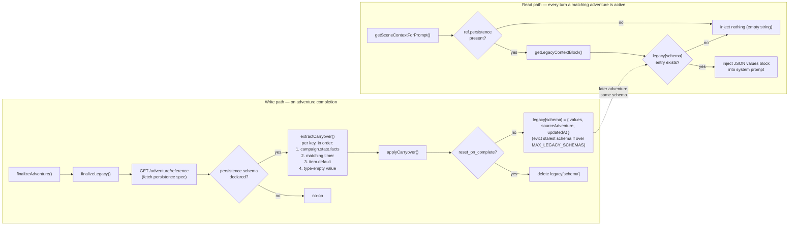

# Design Deep Dive: Fate's Edge AI GM Bot

This document explains *how* the bot works, not just what it does — the mechanisms behind the
Adventure Director's dynamic-growth engine, climax pacing/forcing, the Legacy Tracker, how
`adventure-context.js` assembles what the LLM actually sees each turn, and the optional voice/audio
pipeline (TTS narration, RVC voice cloning, and the Reactive Soundscape — see §6). It complements
[README.md](README.md) (feature list, module table, setup) and
[adventure_manual.md](adventure_manual.md) (adventure-author/GM-facing command reference) —
this document is for anyone modifying the bot's internals or trying to understand *why* it
behaves the way it does.

It assumes you've read the "Architecture" and "Modules" sections of the README first.

---

## 1. Two kinds of adventures, one state machine

Every adventure the bot runs — whether a hand-authored JSON module in the server's
`data/adventures/` folder (or installed via `POST /api/modules`) or one
generated on the fly from a Crown Spread draw — passes through the same server-side status
machine (`server/adventure.js`): **`planned` → `active` → `completed`**. A reset adventure goes
back to `planned` but keeps its `moduleId` and content intact, which is a distinct state from
"nothing loaded at all." `adventure-context.js`'s `isAdventureActive()` is the single shared
definition of "is something actually running right now," and both `adventure-director.js` and
`adventure-context.js` are written to always go through it rather than re-deriving the check —
that's a lesson learned from an earlier version of the bot where the two files' ad-hoc checks of
`current.status === 'active'` quietly drifted apart.

Don't confuse the bot's own `campaigns/` folder with adventure module storage — it's unrelated.
`campaigns/` may contain a leftover `{ROOM}_code.txt` file from an older persistence scheme, but
`world-manager.js`'s `CampaignManager` no longer reads or writes it — that field
(`this.codeFilePath`) is set in the constructor and never touched again. Auto-save/auto-load now
go through a *deterministic* per-room slot on the socket server itself
(`POST`/`GET /api/rooms/:code/campaigns/auto-save`, called after nearly every command via
`orchestrator.campaign.save()`), keyed by the room code rather than a random generated code, so
there's no local pointer file needed to know which save is current any more — see the
`_loadAutoSave()`/`save()` comments in `world-manager.js` for the full before/after. The old
random-code endpoint (`POST/GET /api/rooms/:code/campaigns[/:code]`) still exists, but only for
the explicit, opt-in manual share flow (`!gm upload` / `!gm load <code>`, `exportSnapshot()`/
`importSnapshot()`), a deliberately different mechanism from automatic restart-survival
persistence. It has never contained adventure content. The bot repo also
carries its own local mirror of `data/adventures/*.json` plus `data/docs/adventures/*.html`, but
that copy exists only so `adventure-context.js` can read `getAdventureDoc()`'s full prose text and
the manifest for the LLM prompt — the module the server actually *loads and runs* always comes
from the socket server's own `data/adventures/` (or `server/modules/`), independent of whatever
the bot's local copy contains.

What differs between the two adventure kinds is **`dynamicGrowth`**, a flag stamped onto the
adventure state when it's created:

- **Pre-written modules** (`dynamicGrowth: false`) play through exactly the acts/scenes their
  JSON file defines. When the last scene of the last act completes, the adventure simply
  completes. No generation is ever involved.
- **Crown-Spread-seeded adventures** (`dynamicGrowth: true`) start from a single LLM-generated
  synthesis of a 5-card draw — a title, themes, and an opening act — and *grow* new scenes and
  eventually a climax act on demand, driven by actual play, rather than being fully authored
  upfront. This is what the rest of this document mostly concerns itself with.

## 2. The dynamic-growth engine

Everything below lives in `adventure-director.js`'s "DYNAMIC GROWTH ENGINE" section, and the
whole thing is driven by one entry point: **`handleSceneComplete(context, notes)`**, called from
`commands/process-tags.js` whenever the AI emits a `[SCENE COMPLETE "notes"]` tag. It's a
decision tree, evaluated fresh every time a scene ends:

1. **Fetch current state** (`GET /adventure`). If nothing's loaded, it's a silent no-op —
   scene-tracking doesn't apply to freeform play.
2. **Compute `wouldExhaust`** — is this the last scene of the last act in the current table of
   contents? If not, this is either an ordinary sequential advance or a climax-pacing check (see
   §3 below) — no generation needed either way.
3. If it *would* exhaust the content **and** the adventure isn't dynamic-growth, let it complete
   naturally — a pre-written module ends when its author wrote its ending, full stop.
4. If it's dynamic-growth and the climax act itself just finished, also let it complete —
   `wouldExhaust` being true *during* the climax act means the climax's own final scene just
   concluded, which is the adventure's real ending.
5. Otherwise, dynamic-growth content is genuinely running low. Check `sessionsPlayed` (a purely
   manual counter, incremented only by `!gm session end` — see §2.2) against
   `climaxAfterSessions` (default 4, `DEFAULT_CLIMAX_AFTER_SESSIONS`):
   - **Climax due** → `generateAndAppendClimax()`: one LLM call asks for a 1–2 scene concluding
     act, framed explicitly as bringing the story "to its climax and conclusion." The result is
     appended as a new act, `climax-triggered` is POSTed (flips `state.climaxTriggered`), and the
     director advances into it.
   - **Climax not yet due** → `generateAndAppendScene()`: one LLM call asks for exactly one new
     scene continuing the *current* act, given the campaign summary, known Facts, and how the
     previous scene just ended. Appended, then advanced into — same "append before advance" trick
     both generation paths use, which lets the server's own ordinary sequential-advance logic land
     on the new content without the director needing to compute act/scene indices itself.



*(The forced-twist check in step `F`/`G` runs before the `wouldExhaust` tree is evaluated for a
generation decision — it's checking a separate, independent pacing concern that can fire on ANY
scene-complete while a climax is underway, not just the last one.)*

Both generation calls use `parseAdventureJson()`, a forgiving JSON extractor shared with the
original Crown Spread adventure-builder — it tolerates an LLM prefacing its JSON with prose
("Here's the scene:") instead of requiring the response to be *only* JSON, because that failure
mode reliably happened often enough in practice to be worth hardening against. Both also have a
plain-language fallback scene if generation or parsing fails outright, so a flaky LLM call
degrades to a serviceable (if generic) scene rather than breaking the adventure.

### 2.1. Why session count, not scene count or LLM judgment

`DEFAULT_CLIMAX_AFTER_SESSIONS` is a deliberately simple, table-legible metric: real-world game
sessions, marked by a human typing `!gm session end` at the end of a night's play — not scene
count (which varies wildly with how much a table role-plays out any given scene) and not an LLM
judgment call about "does this feel like enough story yet" (which the bot has no reliable signal
for, and which would make pacing unpredictable from the players' side). A GM always knows exactly
how many sessions until the climax, because `!gm session end`'s reply says so outright ("2/4
sessions. 2 more before the climax begins").

### 2.1.a. Why 4 sessions, and how far that default can actually be tuned today

`DEFAULT_CLIMAX_AFTER_SESSIONS = 4` (and `DEFAULT_CLIMAX_PAD_SCENES = 2`, §3) are the developer's
own judgment calls about a reasonable table pace, documented in the source as exactly that — the
comment above the constant reads "could be made configurable per-adventure later ... if 4 doesn't
fit your table's pace." There's no playtesting telemetry backing the specific number; it's a
sensible starting default, not a tuned constant.

Worth being precise about the *current* limits of "configurable," since it's easy to overstate:
`server/adventure.js`'s `POST /adventure/load-custom` route genuinely accepts `climaxAfterSessions`
and `climaxPadScenes` as request-body overrides — the REST layer supports per-adventure tuning.
But today, the only caller on the bot side is `adventure-director.js`'s Crown Spread synthesis
flow, and it always passes the module-level `DEFAULT_CLIMAX_AFTER_SESSIONS` /
`DEFAULT_CLIMAX_PAD_SCENES` constants verbatim (see the `load-custom` call in the Crown Spread
handler) — nothing in the bot currently asks a GM for a different value, and pre-written,
file-based modules (`loadAdventureModule()`) can't opt into growth at all: the server forces
`dynamicGrowth: false` and resets both fields to their defaults on every load, regardless of
anything a module's own JSON file might contain. So in practice, every dynamic-growth adventure
today runs on the same 4-session / 2-scene-pad pace; the API is ready for per-adventure tuning,
but the bot doesn't yet expose a lever for it (e.g. a prompt during Crown Spread setup, or a
module-JSON field `loadAdventureModule()` reads before overwriting). That's a natural next step
if a table wants a faster or slower climax without editing source.

### 2.2. `handleSessionEnd()`

A thin wrapper around `POST /adventure/session/end`, which increments `sessionsPlayed`
server-side. Entirely manual by design — chat volume and message count are not reliable proxies
for "the table packed up for the night," so this stays a conscious GM action rather than
something the bot tries to infer.

## 3. Climax pacing and forcing

Once a climax act triggers (`state.climaxTriggered`), a second, independent pacing mechanism
takes over — separate from the "is there content left" check in §2, because a climax act can
itself run long even though it's the last act in the table of contents.

`handleSceneComplete()` checks this *before* the `wouldExhaust` decision tree runs at all:

```
if (state.climaxTriggered && !state.climaxForced && !wouldExhaust) {
    const pad = state.climaxPadScenes || DEFAULT_CLIMAX_PAD_SCENES;  // default 2
    if ((state.climaxScenesSinceTrigger || 0) >= pad) {
        return await generateForcedClimaxTwist(context, state, notes);
    }
}
```

`climaxScenesSinceTrigger` is a server-side counter (`server/adventure.js`) that increments once
per scene-complete *while* `climaxTriggered` is true. `climaxPadScenes` is how many such scenes
the climax is allowed before the director steps in — either the adventure module's own declared
value (see §3.2), or the default of 2. `!wouldExhaust` guards against forcing a twist on the
climax's own genuine final scene, which would be redundant (that scene completing already ends
the adventure normally).

### 3.1. `generateForcedClimaxTwist()`

Fires **at most once per climax** (gated by `state.climaxForced`, flipped via
`POST /adventure/climax-forced` — the one API surface added specifically for this feature). It
asks the LLM for one short, "the world refuses to wait any longer" scene — explicitly framed as
forceful and short ("a ticking threat completes, reinforcements arrive, the ground gives way, the
villain acts first, whatever fits THIS story's own stakes") rather than a generic filler beat.
It's appended to the *current* act (the climax act, not a new one), `climax-forced` is POSTed,
and the director advances into it — same append-then-advance pattern as §2's generation paths.

This exists because a climax act, by construction, has no more content beyond what was generated
for it — unlike §2's ordinary scene generation, which can keep extending a non-climax act
indefinitely. Without this mechanism, a table that spends several sessions inside a climax scene
without narrating toward a `[SCENE COMPLETE ...]` tag (or an AI that keeps elaborating rather
than concluding) could leave an adventure stuck in its climax with no natural exit. The forced
twist is the escape hatch: the story pushes itself forward regardless of what the party was
doing.

### 3.1.a. What the LLM is actually given

The prompt built inside `generateForcedClimaxTwist()` is deliberately narrow — it does **not**
pull the adventure's themes, bestiary, or recent chat history the way some other generation calls
do. It's built from exactly three pieces of context:

- The adventure's `title`.
- `context.orchestrator.campaign.getNarrativeSummary()` — the bot's stored free-text narrative
  recap (the same one shown in `!gm adventure debug` and reused elsewhere), or a placeholder
  string if there isn't one yet.
- `notes` — whatever the AI passed as the `[SCENE COMPLETE "notes"]` tag's argument for the scene
  that just ended, i.e. a one-line note on how that scene concluded.

The instruction text itself does the framing work: it tells the model the party has been taking
longer than expected, to write ONE short forceful scene that pushes the climax toward its
conclusion "regardless of what the party was in the middle of," to let the twist fit "THIS story's
own stakes" rather than defaulting to a generic insert, and to keep it short and punchy. There's
no separate table of stock "dramatic turn" templates — the model improvises the twist's specific
content from the summary + notes it's given, constrained only by that instruction text. On
parse/generation failure it falls back to one fixed generic scene ("The Reckoning Accelerates" —
see §2's fallback-on-failure pattern), same as the other two generation paths in §2.

### 3.2. Author control: `climaxPadScenes` — API-ready, not yet author-facing

Unlike most of this document's other module-level knobs, `climaxPadScenes` is **not** something
you can currently set in an adventure module's own JSON file and have it take effect — see
§2.1.a above for exactly why (the REST layer accepts it as a `load-custom` override; nothing in
the bot currently threads a module-authored value into that call). Today, every dynamic-growth
adventure uses the same hardcoded default of 2. If you want a different pad for a specific
Crown-Spread-seeded adventure right now, the only way is a manual override via the server API
directly, or editing `DEFAULT_CLIMAX_PAD_SCENES` in `adventure-director.js` and
`adventure-context.js` (kept in sync by convention, since both read the same server-provided
field and neither imports a shared constants module for it — worth fixing if a third file ever
needs the same default).

### 3.3. Narration constraints during the climax

`adventure-context.js`'s `getSceneContextForPrompt()` — the function that builds the block of
text injected into the LLM's system prompt every turn — checks `state.climaxTriggered` and, if
true (and the adventure isn't yet `completed`), injects a large, explicitly-labeled
**"YOU ARE NOW IN THE FINAL ARC"** block: short/punchy sentence-length constraints, an
instruction to escalate stakes with every action, a ban on filler (shopping, travel montages,
idle small talk), and a directive that every roll's stakes should feel higher than they did
earlier in the adventure. It also reports `climaxScenesSinceTrigger`/`climaxPadScenes` numerically
("expected to resolve within roughly N more scene(s)") so the model has a concrete sense of how
much runway is left, and — if a forced twist already fired this climax — an extra line telling
the model not to let the pacing stall again.

This is deliberately framed as a **hard constraint block**, not a soft suggestion woven into
flavor text elsewhere in the prompt — the goal is a noticeable, consistent shift in prose style
the moment a climax begins, distinguishable from the adventure's earlier, more unhurried pacing.

## 4. The Legacy Tracker (adventure-specific carryover)

`modules/legacy-tracker.js` solves a specific continuity problem: `adventureArchive` (see
`finalizeAdventure()` in `adventure-director.js`) already keeps a short prose summary of each
completed adventure for narrative color, but prose summaries are a poor mechanism for **specific,
reusable facts** an adventure author actually wants a *later* adventure to react to
mechanically — "the party sided with the Millhouse family," "the bridge toll is now waived,"
"NPC X owes the party a favor." The Legacy Tracker is a small, purpose-built structured store for
exactly that.

### 4.1. The `persistence` schema

An adventure module opts in by declaring a `persistence` block in its JSON (surfaced verbatim by
the server's `GET /adventure/reference` endpoint, alongside the module's NPCs/locations/etc.):

```json
"persistence": {
  "schema": "fenwood-legacy-v1",
  "carryover": [
    { "key": "fenwood_ledger", "type": "timer", "default": 0, "max": 12 },
    { "key": "heirlooms", "type": "inventory", "items": [] },
    { "key": "oaths", "type": "list", "fields": ["name", "to_whom", "status"] },
    { "key": "npc_status", "type": "dictionary", "default": "unknown" }
  ],
  "reset_on_complete": false
}
```

- **`schema`** is a stable id. Only modules that declare the *same* schema id ever read or write
  each other's legacy state — this is what lets a trilogy's second module say "if module 1's
  ending is known, react to it" without every unrelated adventure in the campaign accidentally
  sharing state.
- **`carryover`** is an array of objects, not a flat list of key names — each entry is
  `{ key, type?, default?, max? }` (`type` is one of `'timer' | 'inventory' | 'list' |
  'dictionary'`, informational/for-your-own-authoring-clarity rather than validated against the
  extracted value's actual shape). See §4.3 below for exactly how each key's *value* gets
  populated — the schema only declares which keys matter and what their fallback should be, not
  how they're filled during play.
- **`reset_on_complete`** (optional, default `false`): if `true`, completing an adventure with
  this schema *clears* the schema's entry instead of writing it. Useful for a schema meant to
  describe "state going into the next adventure specifically" rather than an accumulating record.

### 4.2. Storage and eviction

Legacy state lives at `orchestrator.campaign.state.legacy`, keyed by schema id, and rides along
with the bot's existing campaign save/load — no separate persistence layer. It's capped to a
small number of schemas; when the cap is exceeded, the **stalest** schema (oldest `updatedAt`,
not the one just written) is evicted first, so a schema in active use is never the one dropped.

### 4.3. Write path — `finalizeLegacy()`

Called from `finalizeAdventure()` **before** anything else in that function runs — while the
completed module's reference data (and its `persistence` declaration) is still fetchable, since
the server's own module context can change once selection re-prompts. It's deliberately
non-blocking on failure: any error is logged and swallowed rather than thrown, so a broken or
unreachable adventure engine at exactly the wrong moment degrades to "no legacy captured this
time," never to "the adventure fails to conclude." This mirrors the bot's general philosophy
around auxiliary state (see also the Elasticsearch long-term memory module, which no-ops
identically when unreachable) — narrative continuity features are additive, never
availability-critical.

#### 4.3.a. How each key's value is actually populated

The bot has no generic named-variable store beyond scene/campaign timers (numeric-only) and
`campaign.state.facts` (the existing free-text `!gm fact <key> <value>` / `[FACT key value]` bag).
Rather than inventing a second parallel tracking mechanic just for legacy state,
`readCarryoverValue()` resolves each `carryover` item's live value, at finalize-time, in this
fixed order — the first source that has an answer wins:

1. **`campaign.state.facts[key]`**, if a GM or the AI ever set that exact key during play (via
   `!gm fact <key> <value>` or `[FACT key value]`). Facts are always stored as plain strings, so
   the stored string is `JSON.parse`'d back into a real array/object/number when possible (e.g. a
   fact set to `["laurel_seal","bell_shard"]` becomes a real array); a plain string that isn't
   valid JSON is used as-is.
2. **A same-named timer**, but *only* for `type: 'timer'` carryover items with no matching fact.
   Checks the finished adventure's `campaignTimers` and the final scene's own `timers`, matched
   loosely by name (case-insensitive, underscores/spaces interchangeable, substring match either
   direction) — an authored timer is very unlikely to be named with the carryover key's exact
   snake_case spelling, so the match is deliberately forgiving. If `max` is also given on the
   carryover item, the resulting value is clamped into `[0, max]`.
3. **The item's own `default`**, if one was given in the schema.
4. **A type-appropriate empty value** as the last resort, so extraction never throws on a key
   nobody ever touched during play: `0` for `timer`, `[]` for `inventory`/`list`, `{}` for
   `dictionary`, `null` otherwise.

In practice this means an adventure author who wants precise legacy tracking sets the relevant
Facts during play (by hand, or by having the AI emit `[FACT ...]` at the right narrative beats —
the same mechanism already used for ordinary campaign Facts) rather than relying on any kind of
automatic state extraction; there is no LLM call anywhere in this write path, and no
`_gmhints`-driven extraction rule — the legacy tracker is a deterministic key/value lookup, not a
summarization step. `_gmhints` and knowledge structures are how an author might *prompt themselves
or the AI* to remember to set the right Fact at the right moment, but the tracker itself has no
awareness of `_gmhints` at all.



### 4.4. Read path — `getLegacyContextBlock()`

Called every turn from `adventure-context.js`'s `getSceneContextForPrompt()`, gated behind
`ref?.persistence` being truthy (i.e., only when the *currently loaded* adventure itself declares
a schema). If a previous adventure using that same schema left an entry behind, its values are
formatted into the system prompt as a labeled block — injected every turn, not just once at load,
so the model references the exact same carried-over figures consistently throughout a session
rather than only at adventure start.

### 4.5. GM-facing controls — `!gm adventure legacy`

- `!gm adventure legacy` — list every schema with tracked state.
- `!gm adventure legacy <schema>` — show one schema's full values.
- `!gm adventure legacy <schema> set <key> <value>` — manual override (JSON-parsed when possible,
  else stored as a plain string — the same "try JSON, fall back to string" convention used
  elsewhere in the bot, e.g. Facts).
- `!gm adventure legacy <schema> clear` — wipe a schema's entry entirely.

These exist for the same reason `!gm fact <key> <value>` exists alongside `[FACT ...]` tags: the
AI-driven extraction path is the common case, but a human GM sometimes needs to correct or seed
state by hand (e.g. importing legacy state from a campaign that predates this feature, or fixing
a mis-extracted value) without waiting for another full adventure completion cycle.

## 5. How it all reaches the model: `getSceneContextForPrompt()`

`adventure-context.js`'s `getSceneContextForPrompt()` is the single function that turns "what's
happening in the adventure right now" into text the LLM actually reads. It's rebuilt on every
turn (subject to a 15-second cache TTL, cleared immediately by `invalidate()` whenever any command
mutates adventure state) and assembles, roughly in order:

1. **Knowledge/secrets state** (§5.1 below).
2. **Legacy/carryover state** (§4.4 above) — only present when the loaded adventure declares a
   matching schema and a prior entry exists.
3. **Climax narration constraints** (§3.3 above) — only present once `climaxTriggered` and not
   yet `completed`.
4. Current adventure/act/scene state, including active-encounter type-specific vocabulary
   (combat vs. lockpick vs. heist vs. social, etc. — see `objective-types.js`).

The ordering matters loosely — climax constraints are placed as a hard "obey these constraints"
block specifically so the model can't miss it among the more descriptive scene-context lines that
follow. Everything here is stateless-per-call from the caller's perspective: `adventure-director.js`
never has to know or care how the prompt block is assembled, only that calling `invalidate()`
after a mutation guarantees the next call reflects it.

**Ad-hoc timers are deliberately NOT part of this function.** `ai-gm-bot.js`'s own prompt-assembly
step calls `adventure-context.js`'s separate `getAdhocTimersForPrompt()` unconditionally, alongside
(not inside) the `getSceneContextForPrompt()` block above, precisely *because* GM/AI-improvised
timers (§ ad-hoc timers in the README's Modules table) exist independent of whether an adventure is
even loaded — gating them on adventure state the way everything else in this section is gated would
mean the AI could create/tick a timer via `[TIMER ...]` outside an adventure and never see its
current value again next turn. Both calls share the same 15-second-cache-then-`invalidate()` pattern,
just against separate cache entries (`getSceneContextForPrompt()`'s adventure-state cache vs.
`getAdhocTimers()`'s own).

### 5.1. Knowledge/secrets state

Adventure modules can define a top-level `knowledge` array — the mechanism `_gmhints` predates
and complements: `_gmhints` is free-form GM-voice guidance, `knowledge[]` is a structured,
individually-trackable secret. Each entry has:

- **`id`** — a stable identifier, targeted by `[REVEAL "id"]`/`[HIDE "id"]` tags and by
  `!gm knowledge reveal/hide <id>`.
- **`gm`** — the full truth. Never shown to players directly; this is what `getPublicState()`
  withholds from player-facing views until the entry is revealed.
- **`player`** *(optional)* — what players currently know or have been told about this thread
  before the reveal (often `null`/absent, meaning "nothing yet").
- **`revealed`** — boolean, flipped by `[REVEAL "id"]`/`[HIDE "id"]` (AI-driven) or
  `!gm knowledge reveal/hide <id>` (GM-driven).
- **`revealCondition`** *(optional)* — GM-facing guidance on when narratively it's appropriate to
  reveal this (not machine-evaluated; the model reads it as an instruction, not a trigger).

The important nuance: **unrevealed entries are not withheld from the model** — the model needs the
truth to write consistent hints, red herrings, and NPC behavior around a secret it can't yet state
outright. So for each unrevealed entry, `getSceneContextForPrompt()` injects *both* lines — the
`gm` truth, explicitly marked "DO NOT reveal," and the current `player`-safe line — inside a block
headed "GM/AI EYES ONLY." Only once `revealed` flips true does the entry collapse down to a single
line (just the `gm` text, now safe to state openly). This is what makes the reveal tags meaningful
in the first place: the AI already knows the secret from turn one, and `[REVEAL "id"]` is the
model's own signal that its narration just crossed the line from "hint around it" to "confirmed it
outright" — not a request for the server to hand it new information it didn't have before.

## 6. Voice & audio pipeline (TTS, voice cloning, reactive soundscape)

Three optional, independently-toggleable audio features sit on top of the narrative engine
described in the sections above. None of them is required to run the bot — each is entirely
off by default, and each degrades to "the text still arrives as normal chat" (or, for the
soundscape, "nothing happens") rather than ever blocking gameplay. This section walks through
how each one actually moves data end to end, and why it's shaped the way it is; for the
user-facing setup steps see README.md's "Voice Narration," "Voice Cloning," and "Reactive
Soundscape" sections.

### 6.1. Voice Narration (TTS) — `modules/tts-client.js`

**What it does:** synthesizes speech for the GM/assistant-GM's own chat replies and broadcasts
the audio alongside the text, so every connected client *hears* the reply in addition to reading
it.

**Data flow:**

```
ai-gm-bot.js (after sendChat(clean))
  → ttsClient.synthesize(text)                       [modules/tts-client.js]
      → POST {TTS_URL}  { text, voice, format }
      ← raw audio bytes  →  base64-encoded, tagged with its actual format
  → sendWS('tts-audio', { audio, text, voice, format })
      → socket server relays to the room             [socketio-handlers.js / ws-handlers.js]
          → web client: decodeAudioData() + Web Audio API playback (opt-in toggle)
          → Foundry bridge: AudioHelper.play() via a data: URI (client-scoped opt-in setting)
          → Discord bot: @discordjs/voice, transcoded through FFmpeg/prism-media (opt-in channel config)
          → Roll20 / terminal / Python clients: acknowledged (logged), not played — no audio
            capability in those environments
```

**Why base64-over-WebSocket, not a separate audio-fetch endpoint:** the room's WebSocket
connection is already the single channel every client (web, Foundry, Discord, bots) is
guaranteed to have open and authenticated on. A parallel HTTP audio endpoint would mean a second
auth story and a second connection per client, for a payload that — per line of narration — is
usually well under a megabyte. `WS_MAX_PAYLOAD_BYTES` (default 8 MiB, see the socket server's
`config.js`/`index.js`) exists specifically to keep this payload from being the thing that trips
a default Socket.IO/`ws` frame-size limit.

**Why `format` is an explicit field, not inferred:** early in this feature's life the returned
object only carried `audio`/`text`/`voice` — every consumer either hardcoded `'wav'` or guessed.
That was fine for the web client (`decodeAudioData()` sniffs the container from the bytes
themselves) but broke down the moment a consumer needed to construct a `data:` URI (Foundry) or
decide whether to transcode before sending to Discord's voice pipeline — both need to *know* the
format up front, not discover it by trial and error. `synthesize()` now always returns the real
format it requested from `TTS_URL` (`TTS_FORMAT`, default `wav`), and every downstream consumer
reads it from the payload instead of assuming.

**Fail-soft posture:** `synthesize()` returns `null` on any failure (unreachable `TTS_URL`,
timeout via `TTS_TIMEOUT_MS`, non-2xx response) — never throws past its own boundary. The caller
in `ai-gm-bot.js` only sends `tts-audio` when it gets a non-null result, and the narration *text*
has already gone out via the ordinary `sendChat()` call regardless, so a slow or down TTS service
costs voice, never the reply itself.

### 6.2. Voice Cloning (RVC) — a second, optional layer on `tts-client.js`

**What it does:** re-voices the TTS output above through a second HTTP service running
[RVC](https://github.com/RVC-Project/Retrieval-based-Voice-Conversion-WebUI) (Retrieval-based
Voice Conversion), so instead of whatever stock voice the TTS service shipped with, the GM
consistently sounds like one specific trained voice model across the whole campaign.

**Data flow:** `synthesize()`'s existing TTS result is passed into `convertVoice(audioBase64,
format)`, which POSTs `{ audio, format, voice: RVC_VOICE }` to `RVC_URL` and accepts either raw
audio bytes or `{ audio: base64 }` JSON back (there's no single standard HTTP contract across RVC
forks/servers the way there roughly is for TTS, so this is a small, explicit, documented contract
rather than an attempt to match an external standard — see README's "Voice Cloning" section for
the exact shape). On success, the result's `audio`/`format`/`voice` fields are overwritten with
the converted version before it's ever broadcast — every downstream consumer (web/Foundry/Discord)
is unaware RVC even exists; it just receives narration audio.

**Caching, and why it's scoped the way it is:** a lot of GM narration reuses short stock phrases
verbatim ("Roll for it!", scene-transition boilerplate), and voice conversion is a second network
round-trip that's often slower than TTS synthesis itself — especially on CPU. `tts-client.js` keeps
an in-memory LRU `Map` (`RVC_CACHE_SIZE`, default 50 entries), keyed on a SHA-256 hash of
`text + voice + rvcVoice + format`, covering the *whole* pipeline: a cache hit skips both the TTS
and RVC network calls, not just the conversion step. This is a plain exact-match cache, not a
paraphrase/similarity match — most AI-generated narration is unique enough per turn that fuzzy
matching wouldn't help much, and a wrong "close enough" hit would mean genuinely wrong audio
playing over the table.

One correctness detail worth calling out because it was a real bug caught during development: a
failed RVC conversion must **never** be cached under the success key. An early draft cached
whatever `synthesize()` returned regardless of whether `convertVoice()` actually succeeded — which
meant a transient RVC outage would get "stuck": the first failure during that outage would cache
the un-cloned fallback audio under that exact line's cache key, and every repeat of that line would
keep serving the un-cloned fallback *even after RVC recovered*, until the LRU entry eventually aged
out. The fix moves `cacheSet()` inside the `if (converted)` success branch only, so a failed
conversion always gets a fresh retry next time, and a down RVC service costs voice consistency for
exactly as long as it's actually down — never longer.

### 6.3. Reactive Soundscape — `adventure-context.js` + `adventure-director.js` + `[MOOD "..."]`

**What it does:** shifts the *background ambience track* the web client is looping, keyed to the
scene's mood — a completely separate axis from voice narration above (this changes what music is
playing, not who's speaking).

**The trackId problem, and why the mapping lives where it does:** the bot cannot itself invent a
meaningful ambience track to play — track ids are generated client-side, per room, when a GM adds
a track to their web client's soundboard (`core/soundboard.js`'s `addSoundTrack()`). So the bot
can only ever *reference* a track a human already created, never conjure one. This is why the
mood → trackId profile is GM-authored configuration (`data/soundscape-profile.json`, or the
`SOUNDSCAPE_PROFILE` env var for a compact inline alternative), not something the bot derives on
its own — `adventure-context.js` just resolves a mood string against whatever mapping the GM
supplied, and emits nothing at all when no profile is configured (`isSoundscapeEnabled()` false)
or the resolved mood isn't in it.

**Two distinct triggers, one resolution path:**

1. **Automatic, on scene change.** Every scene-advance path in `adventure-director.js`
   (`advanceAndReport()`, `generateAndAppendScene()`, `generateAndAppendClimax()`,
   `generateForcedClimaxTwist()`) used to duplicate the same `apiRequest('POST', ['adventure',
   'scene'])` + `adventureContext.invalidate()` pair inline; all four now go through a single
   `advanceScene()` helper, which is also where `maybeSendAmbience()` hangs off — one choke point
   means a scene change triggers ambience resolution regardless of which of the four paths caused
   it, instead of needing the hook re-added at each call site (and inevitably missed at one of
   them). The mood itself is resolved by `inferSceneMood()`: an explicit `mood` field an adventure
   module set on the scene wins outright; only when nothing explicit is present does it fall back
   to a light heuristic off the active encounter's type (combat/social/heist-lockpick-trap_ward →
   combat/social/tense) or `climaxTriggered` → `"climax"`. The explicit-wins-over-heuristic
   ordering matters: a module author who deliberately tags a scene's mood should never be
   second-guessed by the fallback.
2. **Explicit, mid-scene.** The AI can call `[MOOD "mood-name"]` in its own narration — parsed by
   `process-tags.js` alongside every other `[TAG ...]` directive — for a mood shift that isn't
   tied to a real scene break (a calm conversation turning hostile without the scene itself
   ending). The system prompt tells the model to reach for this only for that case, since scene
   changes already trigger resolution automatically.

Both triggers funnel through the same `resolveAmbienceEvent(mood, { force })` in
`adventure-context.js`, which also owns a small piece of state: `lastAmbienceMood`, a
one-entry dedupe so an unchanged encounter across many turns of scene-advance doesn't re-fire the
same ambience cue on every single message. The explicit `[MOOD ...]` tag passes `force: true` and
bypasses that dedupe — the AI calling it out loud mid-scene is itself the meaningful signal, even
on the rare occasion it happens to repeat the currently-playing mood.

**On the wire**, the event is deliberately tiny — `{ mood, trackId, transitionDuration }`, no
audio payload — broadcast via the same relay mechanism as `tts-audio` (`socketio-handlers.js`'s
`relayEvents` / `ws-handlers.js`'s direct-broadcast switch), so it needed no special payload-size
handling. The web client's `core/soundboard.js` crossfades to `trackId` over `transitionDuration`
ms (default 2000ms, the "smooth fade" this feature was specifically asked for) using plain
`<audio>.volume` ramping across two overlapping elements via `requestAnimationFrame` — deliberately
not a WebAudio `GainNode` graph, consistent with that module's existing "no WebAudio graph"
design note, since a manual volume ramp gets the identical audible result for a single ambience
loop without pulling in an `AudioContext`. A `trackId` the receiving room's soundboard doesn't
recognize is a silent no-op there, logged at `console.log` for debugging, not an error surfaced to
players — the same fail-soft posture as every other optional feature in this document.

**`SOUNDSCAPE_AUTO_SEARCH` — closing the trackId problem for moods nobody curated.** The trackId
problem above (the bot can't invent a track id) has a second answer besides "the GM must
pre-populate one for every mood": when `SOUNDSCAPE_AUTO_SEARCH=true` and a mood resolves against
neither the manual profile, `adventure-context.js`'s `searchAmbienceForMood()` calls the socket
server's `GET /api/soundboard/search` (a Freesound proxy — see `fates-edge-apps`'s `server/api.js`
and its own DESIGN.md) with a `<mood> ambience` query, and walks the results for the first one
`modules/sound-license.js`'s `classifySoundLicense()` clears as commercial-safe (CC0/CC BY/CC BY-SA/
Sampling+ — never NC or an unrecognized license, since nothing here has a human eyeballing the
license before it reaches every player in the room). `resolveAmbienceEventAsync()` is the async
sibling of `resolveAmbienceEvent()` that both triggers now call: it tries the manual profile first
(unchanged, synchronous, and always wins when it has an entry), and only awaits the Freesound
lookup when that comes back empty and auto-search is on. A failed/unconfigured lookup (most
commonly: the *server* doesn't have `FREESOUND_API_KEY` set — a separate setting from anything on
this bot) warns once via `console.warn` and behaves exactly like auto-search being off from then on
for that call, never throwing past `maybeSendAmbience()`/the `[MOOD]` tag handler's own try/catch.

Since there's no pre-existing track id to reference in this path, the WS event carries `url` (the
Freesound preview URL) and `name` instead of `trackId`, plus `attribution` when the picked
license requires it. The web client's `vtt-connected.js` `soundboardAmbienceHandler` branches on
which field is present: `trackId` plays an existing local track (unchanged); `url` calls the same
`addSoundTrack()` the "Search Sounds" modal uses to create a brand-new local track from that URL
on the spot (attribution attached via `setTrackAttribution()`), then plays that. Each room that
receives the cue ends up with its own independent track pointing at the same URL — there's still
no server-side soundboard state, consistent with the "Nothing here writes to `room.data`" note in
the socket server's own DESIGN.md.

## 7. Design principles this ecosystem leans on repeatedly

A few patterns recur across the Adventure Director, Legacy Tracker, and climax pacing — worth
naming explicitly since they'll likely apply to the next feature added here too:

- **Append-before-advance.** Generated content (a new scene, a climax act, a forced twist) is
  always POSTed to the server *before* the director calls the ordinary scene-advance endpoint.
  This lets the server's existing sequential-advance logic do the work of "land on the newest
  content" without the client computing act/scene indices itself, and it means a failed advance
  after a successful append fails safe — the content exists and a manual `!gm scene next` still
  reaches it.
- **Fail open on auxiliary state, fail closed on core state.** Legacy extraction, campaign
  summaries, and (elsewhere) long-term memory indexing are all wrapped so a failure degrades
  gracefully rather than blocking the adventure from progressing. Core state mutations (scene
  advance, encounter resolve) are not similarly swallowed — those failures are surfaced to the GM
  as an explicit error string, because silently failing to advance the actual game state would be
  far more confusing than a loud error.
  **"Fail open" applies only to auxiliary, additive features, never to gameplay-critical state.**
  If the legacy tracker fails to save, the adventure still completes normally — the table just
  loses that one adventure's carryover. If Elasticsearch indexing fails, long-term recall degrades
  to the ordinary recent-history window, nothing more. These are enhancements layered on top of a
  game that already works without them, so their failure should never be user-facing. A failure in
  an actual scene/encounter/timer mutation is a different category entirely — that's the game
  state itself, and swallowing that kind of error would let the bot's local view of "what's
  happening" silently diverge from the server's, which is exactly the class of bug this document's
  "one shared definition, never two" and "server is the source of truth" principles (below) exist
  to prevent.
- **One shared definition, never two.** `isAdventureActive()`, the climax-pad default, and the
  `persistence`/legacy schema id are each defined or sourced in exactly one place and referenced
  everywhere else, specifically because this bot has previously shipped bugs from two files each
  keeping their own copy of a status check and quietly drifting apart. When adding new
  cross-file state, prefer threading it through `adventure-context.js`'s cache/invalidate pattern
  over introducing a second source of truth.
- **Server is the source of truth; the bot is a well-informed client.** All of the state this
  document describes (`climaxTriggered`, `climaxScenesSinceTrigger`, `persistence`, etc.) is
  owned by `server/adventure.js`, not by the bot. The bot reads it, reacts to it, and POSTs
  mutations back — this is what lets a human GM using the web client and the AI bot coexist in
  the same room without the two disagreeing about what's currently true.

## 8. Troubleshooting common issues

All three checklists below assume `!gm adventure debug` (GM-only) as your first move — it dumps
the full adventure state object, which is where every field named below actually lives.

### 7.1. The bot isn't generating new scenes/climaxes at all

- **Is `dynamicGrowth` true?** Pre-written modules (`loadAdventureModule()`) always run with
  `dynamicGrowth: false` — §2 generation never fires for them, by design. Only Crown-Spread-drawn
  adventures opt in.
- **Is `climaxTriggered` already true?** Once the climax act has triggered, §2's ordinary scene
  generation (`generateAndAppendScene()`) stops — the director is now in §3's climax-pacing branch
  instead, which only ever appends the climax act's own content or, eventually, one forced twist.
  If you expected a plain new scene and got silence instead, this is very likely why.
- **Is `sessionsPlayed >= climaxAfterSessions`?** If so, the *next* `[SCENE COMPLETE ...]` that
  would otherwise run out of content generates a climax act, not another ordinary scene — check
  `!gm session end`'s own reply, which states this explicitly.
- **Did the LLM call itself fail?** Check the terminal/dashboard logs for
  `[AdventureDirector] Scene generation failed, using fallback` (or the climax/forced-twist
  equivalents) — a failure here doesn't block the adventure, it silently substitutes the generic
  fallback scene (§2), so "the bot generated something bland" is a more likely symptom than a
  visible error.

### 7.2. The Legacy Tracker isn't capturing values

- **Does the adventure declare a `persistence` block with a `schema` and a `carryover` array?**
  No block, no tracking — `finalizeLegacy()` is a silent no-op for any module that doesn't opt in
  (§4.3).
- **For each key you expected to carry over: was a matching Fact ever set during play?**
  Per §4.3.a, the only way a value gets populated (short of a `type: 'timer'` match or the
  schema's own `default`) is `campaign.state.facts[key]` — set via `!gm fact <key> <value>` or an
  AI-emitted `[FACT key value]`, with the fact's key spelled **exactly** like the carryover item's
  `key`. There is no LLM summarization step and no `_gmhints`-driven extraction; a key nobody ever
  set a matching Fact (or timer) for just falls through to `default`/empty.
- **For `type: 'timer'` items: does a campaign/scene timer exist with a name at least loosely
  matching the key?** The match is forgiving (case-insensitive, `_`/space-interchangeable,
  substring either direction) but still requires *some* resemblance — a timer named `"Tension"`
  won't match a carryover key of `fenwood_ledger`.
- **Are you checking the right schema id?** `!gm adventure legacy <schema>` only shows entries for
  the exact schema name given; `!gm adventure legacy` with no argument lists every schema that has
  *any* tracked state, which is the faster way to confirm whether anything was captured at all.
- **Did `finalizeLegacy()` actually run?** It's called from `finalizeAdventure()`, which only fires
  when an adventure's status genuinely transitions to `completed` — a `!gm adventure reset` or an
  abandoned adventure never reaches it. Check for a
  `[LegacyTracker] Could not fetch reference data for legacy extraction` warning in the logs if
  you suspect the fetch itself failed.

### 7.3. The climax isn't forcing when it seems like it should

- **Is `climaxTriggered` true?** The forced-twist check (§3) is entirely skipped if the climax
  hasn't even started yet.
- **Is `climaxForced` already true?** It fires at most once per climax — if a twist already
  happened this climax, it won't happen again until a new adventure (and thus a new climax) loads.
- **Is `climaxScenesSinceTrigger >= climaxPadScenes`?** If the pad (default 2, see §3.2) hasn't
  been reached yet, the check simply doesn't trip — this isn't a bug, it means the climax still has
  runway left.
- **Did `wouldExhaust` just become true instead?** Per the decision tree in §2, if the scene that
  just completed was the climax act's own genuine final scene, the adventure completes normally —
  the forced-twist path is specifically skipped in that case (`!wouldExhaust` in the guard clause)
  since forcing a twist on the ending itself would be redundant.

## 9. Accessibility

This bot itself is a headless service with no UI of its own, so there's nothing here to run an
accessibility audit *against* directly — but two of its features are directly accessibility-
relevant to the clients that do have a UI, and are worth calling out explicitly rather than
leaving buried in the "Voice & audio pipeline" section above:

- **Voice Narration (§6.1) is an assistive feature for low-vision/blind players and GMs**, not
  just a production-value nicety — hearing the AI GM's replies read aloud, in addition to (never
  instead of) the text, is the same category of accommodation as a screen reader, just purpose-
  built for this app rather than general-purpose. It's opt-in everywhere it's wired up (web
  client, Foundry bridge, Discord bot), consistent with the web client's own "Type to Speak" chat
  TTS feature (reads incoming chat aloud for players who'd rather listen than read a fast-moving
  log) — the same opt-in pattern, serving the same underlying need, from two different directions.
- **Reactive Soundscape (§6.3) has no accessibility dimension of its own** (it's background
  ambience, always optional, never carries information the way narration or chat text does) —
  noted here only to be explicit that it wasn't overlooked, not because there's anything to report.

The actual accessibility implementation work — ARIA labels, focus management, screen-reader
announcements, contrast, keyboard navigation, and the narration/TTS toggles themselves — lives in
the clients this bot talks to, not in this repo. See
[`fates-edge-apps`'s web client `ACCESSIBILITY.md`](../fates-edge-apps/utilities/javascript/fates-edge-web-client/ACCESSIBILITY.md)
for the full, actively-maintained pass-by-pass record, including the Foundry bridge's
`CONFIG.ariaLabels` support and the Discord bot's embed-alt-text audit, both covered there since
that's where the rest of the cross-client accessibility work is tracked.

## 10. Glossary

- **`dynamicGrowth`** — adventure-state flag. `true` for Crown-Spread-generated adventures (which
  can grow new scenes/a climax act on demand); always `false` for pre-written, file-based modules.
- **`climaxTriggered`** — adventure-state flag. `true` once the climax act has been generated and
  the adventure has entered its final arc; turns on the narration constraints in §3.3 and the
  forced-twist pacing check in §3.
- **`climaxForced`** — adventure-state flag. `true` once a forced climax twist has fired for the
  *current* climax; prevents `generateForcedClimaxTwist()` from firing a second time in the same
  climax. Resets to `false` whenever a new adventure loads.
- **`climaxPadScenes`** — how many scenes a triggered climax is allowed to run before a forced
  twist becomes eligible. Defaults to 2; the REST layer accepts a per-adventure override via
  `load-custom`, though nothing in the bot currently sets one to anything but the default — see
  §2.1.a/§3.2.
- **`climaxScenesSinceTrigger`** — server-side counter; increments once per completed scene while
  `climaxTriggered` is true. Compared against `climaxPadScenes` to decide when to force a twist.
- **`climaxAfterSessions`** — how many `!gm session end` marks a dynamic-growth adventure needs
  before its *next* content-exhaustion moment generates a climax act instead of another scene.
  Defaults to 4 (`DEFAULT_CLIMAX_AFTER_SESSIONS`) — see §2.1.a.
- **`sessionsPlayed`** — manual counter, incremented only by `!gm session end` (§2.2). Never
  inferred from chat activity.
- **`persistence`** — a `{ schema, carryover, reset_on_complete }` block an adventure module may
  declare, opting it into the Legacy Tracker (§4).
- **`schema`** (within `persistence`) — a stable id shared by every module meant to read/write the
  same legacy thread; unrelated modules (no `persistence`, or a different schema) never see it.
- **`carryover`** (within `persistence`) — array of `{ key, type?, default?, max? }` objects
  naming which values to extract at adventure-completion and how to fall back if nothing was set
  (§4.1, §4.3.a).
- **`wouldExhaust`** — a value computed fresh on every `handleSceneComplete()` call: `true` when
  the scene that just completed was the last scene of the last act in the current table of
  contents. Drives the top-level branch of the §2 decision tree (ordinary advance vs. generation
  vs. natural completion).
- **`legacy`** (`orchestrator.campaign.state.legacy`) — the Legacy Tracker's actual storage, keyed
  by schema id. Distinct from `adventureArchive` (§4's opening paragraph), which holds prose
  summaries rather than structured key/value state.
