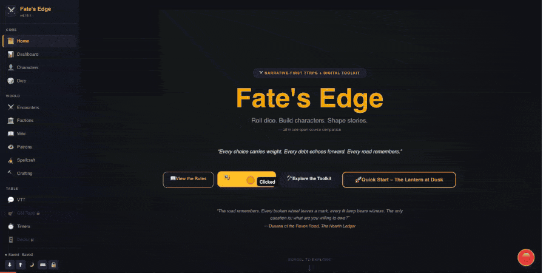
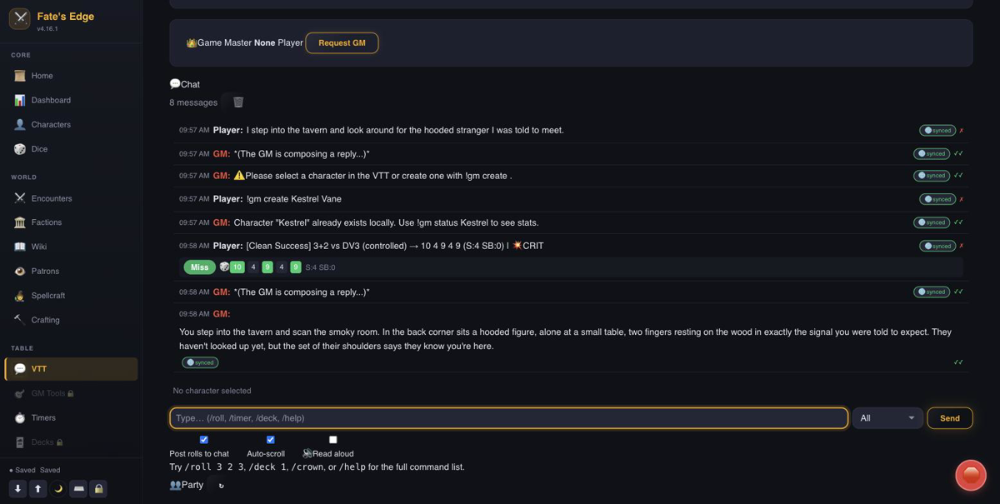
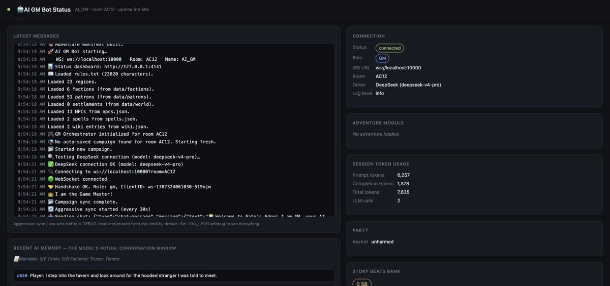

# 🤖 Fate's Edge AI Game Master Bot

An extensible, pluggable AI bot that connects to the Fate's Edge WebSocket server and acts as a fully automated Game Master. It drives the narrative, interprets player actions, rolls dice, manages the Deck of Consequences, and handles timers – all through a simple terminal or headless operation.

> **v4.9.0 was the first public release** (developed privately up to that
> point); the bot has moved forward steadily since — see
> [CHANGELOG.md](CHANGELOG.md) for the full release history and current
> version, and [SECURITY.md](SECURITY.md) to report a vulnerability.

---

## 🎬 Demo



*A real, unscripted session against the client above: `npm run start` connects a fresh bot to a
running [`fates-edge-apps`](https://github.com/Chronophage-net/fates-edge-apps) socket server on
**DeepSeek** (`deepseek-v4-pro`), takes the GM seat, and answers a player's action — "I step into
the tavern and look around for the hooded stranger I was told to meet." — with live narration,
straight from the model, no canned responses.*

This is the bot on its own, talking directly to DeepSeek's API — no Ollama, no local model, no GPU.
[`fates-edge-apps`'s `npm run demo`](https://github.com/Chronophage-net/fates-edge-apps#quick-start)
is a different, heavier thing: a one-command Docker Compose stack (client + server + Redis + a
**local Ollama** instance + this bot) built so anyone can see the ecosystem run with zero API keys.
Reach for that one to explore the whole toolkit hands-off; reach for the setup below when you
already have a `fates-edge-apps` socket server running and want the AI GM itself, driven by
DeepSeek (or OpenAI), talking to it directly.

<table>
<tr>
<td width="50%">

**Live narration, mid-session**


A player rolls (`/roll 3 2 3` → a Fate's Edge d10-pool Clean Success with a Story Beat and a
critical), then narrates freely — the GM answers both in character, composed live by the driver
in `drivers/deepseek-driver.js`.

</td>
<td width="50%">

**The bot's own status dashboard**


`http://localhost:4141` (see "Status Dashboard" below) — connection state, driver/model in use,
and **real token usage reported by DeepSeek's own API** (prompt/completion/total, not an estimate)
for this exact session.

</td>
</tr>
</table>

**Try it yourself** (needs a running [`fates-edge-apps`](https://github.com/Chronophage-net/fates-edge-apps) socket server — see its README for that half):

```bash
git clone https://github.com/Chronophage-net/fates-edge-ai-gm-bot.git
cd fates-edge-ai-gm-bot
npm install
npm run configure        # pick DeepSeek, paste an API key — see "Configuration" below
npm start                 # connects, claims the GM seat, and starts narrating
```

Then open the `fates-edge-apps` web client, join the bot's room, and talk to it. `http://localhost:4141`
shows the same live status view pictured above the moment the bot connects.

---

## ✨ Features

- **Pluggable AI backends** – use OpenAI, Ollama, DeepSeek, or any custom LLM.
- **Automatic GM takeover** – joins the room, requests the Game Master role, and manages GM approvals.
- **Narrative generation** – interprets player chat and creates immersive, descriptive responses.
- **Dice rolling** – uses Fate's Edge dice mechanics (d10 pool, successes, story beats).
- **Calls for rolls instead of auto-rolling** – `[CALL FOR ROLL "Name" Attribute+Skill DV Position
  "optional suggestion"]` prompts the player with what to roll (plus an optional one-sentence GM
  suggestion) and waits for `!gm roll` or a player-typed roll, instead of silently resolving the
  roll on the player's behalf. `[ROLL ...]` still exists for GM/NPC-driven rolls.
- **Deck of Consequences** – draws cards, performs Crown Spreads, and tracks deck state.
- **Structured knowledge state** – adventure modules can define explicit `knowledge[]` secrets
  (a GM-only truth, an optional player-safe cover text, and a live `revealed` gate) as a
  first-class alternative to burying secrets in `_gmhints` prose. The AI flips a reveal the moment
  it narrates one, via `[REVEAL "id"]`/`[HIDE "id"]`; a human GM can do the same with
  `!gm knowledge [list] | !gm knowledge reveal <id> | !gm knowledge hide <id>`.
- **Legacy Tracker** – adventure modules can declare a `persistence` schema (carryover facts that
  survive past a single adventure's completion — reputations, favors owed, lingering
  consequences). The bot reads/writes this state via `!gm adventure legacy [schema] [set <key>
  <value>|clear]` (GM-only) and folds it into the system prompt so the AI can reference prior
  adventures' consequences without re-reading old transcripts — see `modules/legacy-tracker.js`
  and [DESIGN.md](DESIGN.md) for the full mechanism.
- **Climax narration & pacing** – once a dynamic-growth adventure's climax act triggers, the
  Adventure Director tracks scenes-since-trigger against `climaxPadScenes` and, if the climax
  stalls past that pad without concluding, automatically generates a wrap-up twist
  (`generateForcedClimaxTwist()`) and marks it on the server via `climax-forced` — so a session
  can't run indefinitely in the same climax scene. See [DESIGN.md](DESIGN.md).
- **Timer management** – creates and ticks scene timers on demand.
- **Player management** – kick, ban, and unban players directly from the bot's terminal.
- **Conversation memory** – maintains a sliding window of recent messages for coherent stories.
- **MUD‑style terminal** – all events are logged in color, and you can manually override the AI by typing messages.
- **One‑click setup wizard** – a configuration script (`configure-bot.js`) that scans available drivers, prompts for API keys, and writes a `.env` file.
- **Live status dashboard** – a local web page (`http://localhost:4141` by default) showing recent
  activity, the loaded adventure, session token usage, and connection state at a glance — see
  "Status Dashboard" below.
- **AI GM Session Panel** – part of the status dashboard: Story Beats bank, campaign Facts,
  recent AI "memory" (the model's live conversation window), and Obligation totals per Patron —
  a GM-facing view of bot state, distinct from the VTT chat itself.
- **Fuzzy AI tag repair** – normalizes common drift in the model's own `[TAG ...]` syntax (wrong
  case, spacing around `+`, a dropped closing quote/bracket) before parsing, so a well-intentioned
  but slightly malformed tag still resolves instead of leaking into chat as literal bracket text.
- **Assistant GM mode** – a middle tier between full GM and a passive player: the bot keeps
  narrating and keeps running mechanics (rolls, resource math, timers) live, but holds
  narrative-authority tags (`[FACT ...]`, `[NPC CREATE ...]`, `[SCENE COMPLETE ...]`) as pending
  suggestions for the human GM/Co-GM to approve or reject — see "Assistant GM Mode" below.
- **Leveled logging** – `LOG_LEVEL` keeps noisy background chatter (aggressive-sync ticks, raw
  wire traffic) out of the terminal and dashboard by default; flip to `debug` to see it all.
- **Session token tracking** – real usage counts from OpenAI/DeepSeek/Ollama where the provider
  reports them, so you always know roughly what a session is costing (for paid backends) or how
  close to the model's context window you're running.
- **Optional long-term memory** – Facts, NPCs, and campaign summaries can be indexed into
  Elasticsearch for relevance-ranked recall across a long-running campaign ("who knows about the
  cursed well?"), instead of relying only on a fixed recent-history window — see "Long-Term
  Memory" below. Fully optional; the bot works exactly the same without it.
- **Optional voice narration** – point `TTS_URL` at an HTTP text-to-speech service (e.g.
  [Chatterbox](https://github.com/resemble-ai/chatterbox) or Coqui XTTS) and the bot speaks its
  GM/assistant-GM replies into connected clients' voice channel via the socket server, in addition
  to the text it already sends. Off by default, generated in the background so it never delays
  chat, and fails soft if the TTS service is slow or unreachable — see "Voice Narration" below.
- **Optional reactive soundscape** – map moods (`"tense"`, `"combat"`, `"calm"`, ...) to ambience
  tracks already in your web client's soundboard, and the bot crossfades the room's ambience
  automatically on scene changes, or explicitly via `[MOOD "..."]` in its own narration. Off by
  default with no profile configured — see "Reactive Soundscape" below.

---

## 🧱 Architecture

```
players in VTT / terminal
        │
        ▼
┌─────────────────────────────┐
│  Fate's Edge Socket Server  │
│   (WebSocket + REST)        │
└─────────────────────────────┘
        │
        ▼
┌───────────────────────────────────┐        ┌───────────────────────────┐
│     AI GM Bot                     │──────▶│  Status Dashboard (HTTP)   │
│  - ai-gm-bot.js (core)            │        │  localhost:4141, optional │
│  - drivers/                       │        └───────────────────────────┘
│    ├── ai-driver.js               │  ← abstract driver interface
│    ├── openai-driver.js           │
│    ├── ollama-driver.js           │        ┌───────────────────────────┐
│    └── deepseek-driver.js         │──────▶│  Elasticsearch, optional   │
│  - modules/                       │        │  long-term memory only    │
│    (game logic, see "Modules")    │        └───────────────────────────┘
└─────────────────────────────┘
        │
        ▼
┌─────────────────────────────┐
│   AI Backend (OpenAI, etc.) │
└─────────────────────────────┘
```

The core bot is completely decoupled from the AI backend. It communicates with the server via WebSocket and delegates all narrative generation to a **driver**. Drivers implement a simple interface and can be swapped in seconds.

Game logic itself (dice, world data, tag parsing, adventures, etc.) lives in `/modules` and is
driver-agnostic — every driver produces plain text, and `modules/commands.js` parses that text
for `[TAG ...]` markers regardless of which backend generated it. See "Modules" below.

The status dashboard and Elasticsearch are both entirely optional side-components — the bot
works exactly the same with neither running; see "Status Dashboard" and "Long-Term Memory" below.

---

**→ See [INSTALL.md](INSTALL.md) for the full setup guide** — the setup
wizard, Docker, keeping it running long-term, updates, and
troubleshooting, written for anyone who's run a dedicated game server
before. The short version below still works fine too.

## 📦 Prerequisites

- **Node.js** ≥ 18 (includes built‑in `fetch`; no extra dependencies needed for most drivers)
- **A Fate's Edge WebSocket server** — the socket server from the sibling [`fates-edge-apps`](https://github.com/Chronophage-net/fates-edge-apps) repo (`utilities/javascript/fates-edge-socket-server/`), not part of this repo
- **An API key for your chosen AI service** (or a local LLM running via Ollama)

---

## 🚀 Installation

```bash
git clone https://github.com/Chronophage-net/fates-edge-ai-gm-bot.git
cd fates-edge-ai-gm-bot
npm install
```

Core runtime dependencies: `ws` (WebSocket), `dotenv`, and `openai` (used by the OpenAI driver).
`@elastic/elasticsearch` is also installed but only ever loaded if you set `ES_URL` — see
"Long-Term Memory" below; leave it unset and it's inert.

---

## ⚙️ Configuration – The Easy Way

Run the built‑in configuration wizard:

```bash
npm run configure
# equivalent to: node configure-bot.js
```

It will:

1. Scan the `/drivers` folder and display all available backends.
2. Let you pick a driver.
3. Ask for any required API keys (or a file path containing the key).
4. Generate a `.env` file with all necessary settings.

After the wizard finishes, you can start the bot immediately.

### Manual Configuration (optional)

Create a `.env` file in the bot's root directory. `ai-gm-bot.js` selects its driver by
**`AI_PROVIDER`** (`ollama` / `openai` / `deepseek`), not by a driver file path — the wizard also
writes an `AI_DRIVER=./drivers/...` line for reference, but only `AI_PROVIDER` is actually read at
startup. Example for OpenAI:

```
AI_PROVIDER=openai
OPENAI_API_KEY=sk-xxxxxxxxxxxxxxxxxxxxxxxx
AI_MODEL=gpt-4o-mini
WS_URL=ws://localhost:10000
ROOM=AC12
BOT_NAME=AI_GM
```

For Ollama (local or cloud):

```
AI_PROVIDER=ollama
OLLAMA_BASE_URL=http://localhost:11434
OLLAMA_MODEL=mistral
WS_URL=ws://localhost:10000
ROOM=AC12
```

For DeepSeek:

```
AI_PROVIDER=deepseek
DEEPSEEK_API_KEY=sk-xxxxxxxxxxxxxxxx
DEEPSEEK_MODEL=deepseek-chat
WS_URL=ws://localhost:10000
ROOM=AC12
```

---

## 🧠 Driver System

All drivers live in `/drivers` and extend `ai-driver.js`. A driver must implement:

```javascript
class MyDriver extends AIDriver {
    async generateResponse(context, onToken) {
        // context.systemPrompt  – string
        // context.messages      – array of { role: 'user'|'assistant', content: string }
        // onToken (optional)    – callback invoked with each streamed text chunk,
        //                          if the caller wants a live/typing-style reply.
        //                          Ignore it if you don't support streaming.
        // Return the AI's full reply as a string either way.
    }
}
```

The base `AIDriver` class also provides shared utilities every built-in driver uses,
so behavior doesn't drift between backends:

- **`this.contextWindow`** – the model's real context window in tokens. Set this in your
  driver's constructor (ideally overridable via an env var, since e.g. Ollama's window
  depends entirely on which local model is configured).
- **`trimToFit(context)`** – called internally by each built-in driver's `generateResponse()`
  before sending. Trims the system prompt (keeping the head and tail, cutting the middle) and
  drops the oldest chat messages until everything fits inside `contextWindow`, so a small local
  model's provider-side truncation never silently drops the character sheets or rules text
  instead of old chat history. This is a **last-resort safety net** — the real fix for token
  bloat is `ai-gm-bot.js` sending a pruned prompt in the first place (see "Context Management"
  below), not asking the driver to clean up an oversized one every turn.
- **`_fetchWithRetries(url, options, opts)`** – shared retry/backoff/timeout helper for drivers
  that call a raw HTTP API (DeepSeek, Ollama) instead of an SDK with its own retry handling
  (OpenAI, which is configured via the SDK's own `timeout`/`maxRetries` client options instead).

### Built‑in Drivers

| Driver | File | Retries/Timeout | Context Window | Streaming |
|--------|------|------------------|-----------------|-----------|
| **OpenAI** | `openai-driver.js` | Via SDK (`OPENAI_MAX_RETRIES`, `OPENAI_TIMEOUT_MS`) | `OPENAI_CONTEXT_WINDOW` (default 128000) | ✅ |
| **Ollama** | `ollama-driver.js` | `OLLAMA_MAX_RETRIES`, `OLLAMA_TIMEOUT_MS` | `OLLAMA_CONTEXT_WINDOW` (default 8192 — sent to Ollama as `num_ctx` on every request, **set this to match your actual model**, check with `ollama show <model>`) | ✅ |
| **DeepSeek** | `deepseek-driver.js` | `DEEPSEEK_MAX_RETRIES`, `DEEPSEEK_TIMEOUT_MS` | `DEEPSEEK_CONTEXT_WINDOW` (default 64000) | ✅ |

All three now handle transient failures (429/5xx/network errors) with exponential backoff
the same way, instead of that behavior depending on which driver you picked.

To add your own driver, create a file in `/drivers`, implement `generateResponse`, and export a `meta` object:

```javascript
class MyDriver extends AIDriver { ... }
MyDriver.meta = {
    name: 'My Custom LLM',
    description: 'Talks to my server',
    requiredEnv: ['MY_API_KEY']
};
module.exports = MyDriver;
```

It will automatically appear in the configuration wizard's driver list, and the wizard will write
an `AI_PROVIDER=<yourfilename>` line derived from your file's name (`my-driver.js` → `my`). That's
necessary but not sufficient: `ai-gm-bot.js` itself only recognizes the three literal values
`ollama`/`openai`/`deepseek` in its provider switch, so running the bot with a genuinely new driver
also needs one more `else if (AI_PROVIDER === '...')` branch added there by hand — the wizard can't
wire that part up for you.

---

## 🧩 Modules

All game logic lives in `/modules`, separate from the driver layer above. Each module is a
plain CommonJS file (`require`/`module.exports`), most are stateless or take an explicit state
object rather than reaching for globals, and each has a matching test file under
`tests/modules/` (see "Testing" below).

| Module | Responsibility |
|--------|-----------------|
| **`gm-orchestrator.js`** | The brain of the bot — integrates every other module, owns campaign state defaults, and drives the scene lifecycle each turn. |
| **`commands/`** | Parses `[TAG ...]` markers out of the AI's raw text output (`[ROLL ...]`, `[CALL FOR ROLL ...]`, `[APPLY ...]`, `[LOOKUP RULE ...]`, `[SET POSITION/DV ...]`, `[TIMER ...]`, `[DRAW ...]`, `[CROWN ...]`, `[NPC CAST/CREATE ...]`, `[SCENE COMPLETE ...]`, `[TOKEN MOVE/REMOVE ...]`, `[ENCOUNTER RESOLVE ...]`, `[REVEAL "id"]`/`[HIDE "id"]`, and more) and dispatches each to the module that actually performs it. Also handles `!gm` terminal/chat command dispatch. The single highest-blast-radius area in the bot — regex-based tag parsing silently breaks if the model's output drifts even slightly, so every tag handler is covered by `tests/modules/commands.test.js`. Split (as of 4.11.2) into focused files under `modules/commands/`: `gm-commands.js` (the `!gm` dispatcher), `process-tags.js` (the `[TAG ...]` processor), `tag-repair.js` (`repairAITagSyntax()`, which runs first and repairs common AI output drift — wrong case, spacing around `+`, dropped closing quote/bracket — before any tag regex sees the text), `tokens.js`, `characters-sync.js`, `npc-actions.js`, `api-client.js`, and `messages.js`; `index.js` re-exports the same public API every caller already used via `require('./modules/commands')`. When `context.myRole === 'assistant-gm'`, narrative-authority tags (`[FACT ...]`, `[NPC CREATE ...]`, `[SCENE COMPLETE ...]`) are routed to `assistant-suggestions.js`'s queue instead of applied immediately — see "Assistant GM Mode" below. |
| **`assistant-suggestions.js`** | In-memory pending-suggestion queue for Assistant GM mode — `enqueue()`/`list()`/`approve()`/`reject()`/`clear()`. Not persisted to the campaign JSON (a pending suggestion is a proposal, not committed state); see "Assistant GM Mode" below. |
| **`dice.js`** | Fate's Edge dice-pool mechanics: rolling, Position modifiers, the Outcome Matrix (Clean Success / Success with Story Beat / Partial / Miss), Story Beat generation on 1s, Harm/Fatigue application with armor conversion. |
| **`characters.js`** | In-memory character store for the session — attribute/skill resolution (case-insensitive), delta application (Harm/Fatigue/Boons/Obligation/Corruption/Leash) with clamping at their max values. |
| **`world-manager.js`** | Loads and indexes world data (regions, factions, patrons, NPCs, spells, wiki entries) from `data/`. `getRegion()` normalizes a display name to its `data/regions/*.json` filename stem (spaces→underscores, lowercased) — this exact lookup has independently broken and been re-fixed several times across this ecosystem (see "Cross-Repo Region Slug Bug" below), so treat any change here with extra care. |
| **`rules-index.js`** | Splits `data/rules.txt` into named sections and builds a compact section-title index for the system prompt, plus `findSection()` keyword lookup (title match, falling back to body-text match) for `[LOOKUP RULE "..."]`. Lets the bot avoid re-sending the full rulebook every turn — see "Context Management" above. |
| **`travel.js`** | Core Travel Procedure and Worked Itineraries: `generateJourney()` (suit-locked card draws, timer-segment table, policed-region club-source toggling), `generateItineraryJourney()`, `generateTravelersSpread()`, and `handleTravelCommand()` dispatch for the bot's travel subcommands. |
| **`deck.js`** | Deck of Consequences: card draws, Crown Spreads, `transformRegionData()` (converts a region's authored content into the flat suit/rank meaning table), ace effects (region-specific, generic fallback, or partial-key match). |
| **`timers.js`** | Scene- and campaign-level timer create/tick/fill, with boundary clamping so a timer's `current` segment count never exceeds its `max`. |
| **`adventure-director.js`** | Adventure selection and lifecycle — the module selection menu, Crown Spread-driven adventure picks, and handing off into `adventure-context.js`'s scene tracking once one is active. |
| **`adventure-context.js`** | Bridges the bot to the server's Adventure Engine (`server/adventure.js`): `isAdventureActive()` status-machine checks (`planned`/`active`/`completed` × `moduleId` presence) and scene context building for the current turn, including climax-pacing fields (`climaxPadScenes`, `climaxScenesSinceTrigger`, `climaxForced`) and the adventure's `persistence` schema. Must stay in sync with the server-side contract — see that file's own header comment. Also owns the optional Reactive Soundscape mood → trackId profile (see "Reactive Soundscape" below) — no-ops everywhere when no profile is configured. |
| **`legacy-tracker.js`** | The Legacy Tracker — reads an adventure's declarative `persistence` schema, resolves/validates carryover key/value state across adventures, and exposes `!gm adventure legacy [schema] [set <key> <value>|clear]`. See [DESIGN.md](DESIGN.md). |
| **`format-utils.js`** | Small shared text-formatting helpers for chat output: `formatColumns()` (multi-column `ls`-style layout), `shortTitle()` (truncates a long title at its first em-dash/colon). |
| **`logger.js`** | Leveled logging (`error`/`warn`/`info`/`debug`, via `LOG_LEVEL`) shared by the whole bot. Monkey-patches `console.log/warn/error` so every existing call site is automatically level-aware and feeds the in-memory ring buffer the status dashboard reads from — no per-call-site changes needed except the handful of intentionally spammy lines, which call `logger.debug()` directly. |
| **`status-server.js`** | Serves the local status dashboard (see "Status Dashboard" below) — plain `http` + Server-Sent Events, no extra dependency. |
| **`knowledge-index.js`** | Optional Elasticsearch-backed long-term memory (see "Long-Term Memory" below) — indexes Facts/NPCs/campaign summaries and serves relevance-ranked search. No-ops everywhere when `ES_URL` isn't set. |
| **`tts-client.js`** | Optional voice narration (see "Voice Narration" below) — synthesizes speech for the GM's chat replies via any Chatterbox/Coqui-XTTS-shaped HTTP TTS service, with an optional second layer (see "Voice Cloning") that re-voices the result through RVC and caches repeated lines. No-ops everywhere when `TTS_ENABLED` isn't `true`. |

---

## ▶️ Running the Bot

```bash
npm start
```

The bot connects to the WebSocket server, claims the Game Master role, and starts listening to chat.  
Players will see a join message: *"The AI Game Master has joined."*

### Terminal Commands

Inside the bot's terminal you can type:

- **Any text** – sent as a GM chat message (manual override).
- **`/admin players`** – list players in the room (requires `API_KEY`).
- **`/admin kick <clientId> [reason]`** – kick a player.
- **`/admin ban <clientId> [reason]`** – ban a player.
- **`/admin unban <clientId>`** – remove a ban.

For automated admin via the REST API, set the `API_KEY` environment variable to your server's API key.

---

## 🎮 Bot Behavior

1. **Connects and handshakes** as a GM – if another GM is present, it requests the role and will auto‑approve any pending GM vote.
2. **Narrates** each player message using the selected AI backend.
3. **Processes special commands** found in the AI's output:
   - `[ROLL "Name" Attribute+Skill DV N Position]` → performs a dice roll and posts the result.
   - `[DRAW count region]` → draws cards from the Deck of Consequences.
   - `[TIMER name segments]` / `[SET POSITION ...]` / `[SET DV ...]` / `[APPLY HARM/FATIGUE/BOON ...]` → mechanical state changes.
   - `[LOOKUP RULE "Section Title or keyword"]` → looks up and inserts the full text of one rules.txt
     section. The system prompt only includes a compact section-title index by default (see
     "Context Management" below); the model asks for a section by name when it actually needs the
     exact wording of a specific rule, instead of the whole rulebook being re-sent every turn.
4. **Maintains conversation context** (last `MAX_HISTORY` messages, further trimmed per-driver to
   fit the model's real context window — see "Context Management").
5. **Listens for all server events** (presence, player join/leave, deck updates) and logs them in the terminal.

---

## 🧮 Context Management (Contextual Pruning, Not RAG)

Fate's Edge's game data (regions, characters, rules, adventure state) is small and already
structured/indexed in memory — nothing here needs vector search or a retrieval pipeline. The
fix for token bloat is pruning **what** goes into the prompt, not adding an indirection layer
on top of an oversized one:

> **Exception:** `campaignState.facts` and NPCs registered via `[NPC CREATE ...]` are the one
> part of this that genuinely does grow unbounded over a *long-running* campaign — they're
> dumped in full every turn (facts) or only tracked server-side with no way to search them
> (NPCs). That's what the optional Elasticsearch-backed "Long-Term Memory" feature below
> (`modules/knowledge-index.js`) exists for — real retrieval, but scoped specifically to that
> one growing-without-bound category, not applied to the small, already-pruned state above.

- **Rules text**: the system prompt gets a compact index of `data/rules.txt` section titles, not
  the full ~600-line file. The model requests a specific section in full via
  `[LOOKUP RULE "..."]` only when it actually needs one (see `modules/rules-index.js`).
- **Character sheets**: only the character(s) relevant to the current turn — whoever is
  speaking, plus anyone named in their message — get their full sheet (attributes, skills,
  talents, bonds, complications, assets, followers). Everyone else gets a one-line status
  (Harm/Fatigue/Boons/Obligation only), the same way a human GM only actively "holds" the
  character currently in the spotlight.
- **Driver-level `trimToFit()`**: a last-resort safety net (see "Driver System" above) — it
  should rarely trigger if the pruning above is working, and its warnings in the log are worth
  watching for ("dropped N oldest messages" / "system prompt truncated") since they mean a
  turn's context genuinely didn't fit even after pruning.

---

## 🔗 Integration

The bot expects the Fate's Edge WebSocket server to be running.  
Any client (web VTT, terminal client, Discord bot) can join the same room and interact with the AI GM.

### Running Headless (systemd / Docker / `nohup`)

If you run the bot without an attached terminal, set:

```
HEADLESS=true
```

**This matters most for the Ollama driver.** Its model-recovery flow (offering to pull a
missing model, letting you pick from a list) uses interactive terminal prompts — with no
attached stdin, those prompts never resolve and the process hangs forever instead of failing
in a way a process supervisor could detect and restart. With `HEADLESS=true` (or the more
specific `OLLAMA_NONINTERACTIVE=true`), a missing/broken model logs the available models and
throws immediately instead. Combined with the bot's own startup behavior — `driver.initialize()`
failing now exits the process with a non-zero code — a broken AI backend gets you a clean,
supervisor-restartable failure instead of a silently-broken bot that "connects" but can't
actually respond to anyone.

---

## ✅ Testing

```bash
npm test
```

Runs Node's built-in test runner (`node --test`, Node ≥18 — no extra test dependency) over
everything in `tests/`. Layout mirrors the source tree:

```
tests/
├── drivers/
│   ├── ai-driver.test.js       — trimToFit(), estimateTokens()
│   ├── deepseek-driver.test.js — fetch mocked: happy path, retry/backoff, SSE streaming, error formatting
│   ├── openai-driver.test.js   — SDK client mocked: timeout/maxRetries wiring, streaming, initialize() error rethrow
│   └── ollama-driver.test.js   — fetch mocked: HEADLESS fail-fast, retry/backoff, NDJSON streaming, model recovery
└── modules/
    ├── commands.test.js        — [ROLL]/[APPLY]/[LOOKUP RULE]/[SET ...] tag parsing (see below)
    ├── format-utils.test.js
    ├── rules-index.test.js
    ├── travel.test.js
    ├── deck.test.js
    ├── dice.test.js
    ├── characters.test.js
    ├── world-manager.test.js
    ├── timers.test.js
    └── adventure-context.test.js
```

A few things worth knowing before adding to this suite:

- **Fuzzy tag repair**: `commands.js`'s `repairAITagSyntax()` runs before every strict tag regex
  and normalizes the drift patterns real model output actually produces — wrong-case keywords
  (`[Roll ...]`), stray whitespace around the `+` in a roll pool expression (`Body + Melee`), and
  a dropped closing quote/`]`. It only touches spans that open with a known tag keyword, so
  ordinary bracketed prose in the model's narration is left alone.
- **Known gap, not a bug**: `commands.test.js` still documents one `[ROLL ...]` parsing case that
  does *not* resolve — `DV` given as a word (`DV three`) instead of a digit. Marked with a
  `// KNOWN GAP:` comment; if you extend `repairAITagSyntax()` (or the regex) to handle it, update
  the test and drop the marker.
- **Regex-desync fix (all `[TAG ...]` handlers in `commands.js`)**: every tag handler used to
  scan `output` with a stateful global regex (`while ((match = someRegex.exec(output)) !== null)`)
  while also reassigning `output` inside the loop body. Once a replacement's length differs from
  the tag it replaced — normal for every tag here — the regex's internal `lastIndex` pointed at
  the wrong offset in the mutated string, and later tags of the same type in one message could be
  silently left unresolved (found via a test with four `[APPLY ...]` tags in one message; two
  were skipped). Fixed by resetting `lastIndex = 0` after each mutation (and, for the manual
  `[ROLL ...]` fallback parser, by tracking the scan offset from the actual replacement length
  instead of the pre-replacement tag length). `commands.test.js` has a regression test for this.
- Driver tests mock `fetch` or the SDK client directly rather than hitting real APIs — no network
  access or API keys are needed to run the suite.

---

## 🛠️ Troubleshooting

| Symptom | Solution |
|---------|----------|
| `Cannot find module '../ai-driver'` | Ensure `ai-gm-bot.js` requires `'./drivers/ai-driver'` (correct path). |
| `MODULE_NOT_FOUND: node-fetch` | The bot uses built‑in `fetch`; remove any `require('node-fetch')` from driver files. |
| `EADDRINUSE` on port 10000 | Another process is using the port; kill it or change the server port. |
| Bot doesn't become GM | Check that the server supports GM election. The bot auto‑requests the GM role. |
| AI responses are poor | Tune the system prompt inside `ai-gm-bot.js` (around line 170) or adjust the model's temperature. |
| No response from AI | Verify the API key and model name; check server logs for errors. |
| Bot hangs forever at startup, no output, no crash | You're running Ollama headless without `HEADLESS=true` and it hit a missing/broken model — it's stuck at an interactive prompt with no stdin. Set `HEADLESS=true` and restart. |
| Local model narrates with no mechanical grounding (ignores character stats/rules) | The context window is smaller than what's being sent. Set `OLLAMA_CONTEXT_WINDOW` to match your actual model (check its real window, not just this bot's default guess of 8192) and watch the logs for `trimToFit` truncation warnings. |
| `[LOOKUP RULE "..."]` shows up literally in chat instead of the rule text | The tag's quoted title didn't match any `data/rules.txt` section closely enough — check `!gm` logs for the exact query the model sent, or ask it to use the section title verbatim as shown in the index. |

### Environment Variables Reference

| Variable | Applies To | Default | Purpose |
|----------|-----------|---------|---------|
| `HEADLESS` / `OLLAMA_NONINTERACTIVE` | Ollama | off | Skip interactive model-recovery prompts; fail fast instead. **Required for any unattended deployment.** |
| `OLLAMA_CONTEXT_WINDOW` | Ollama | `8192` | Sent to Ollama as `num_ctx` on every request (not just this bot's local trimming budget) — set to your actual model's real context window; check with `ollama show <model>`. |
| `OLLAMA_TIMEOUT_MS` | Ollama | `60000` | Per-request timeout (local models are slow). |
| `OLLAMA_MAX_RETRIES` | Ollama | `1` | Retries on transient HTTP/network failures. |
| `OPENAI_CONTEXT_WINDOW` | OpenAI | `128000` | Context window for the configured model. |
| `OPENAI_TIMEOUT_MS` | OpenAI | `30000` | Passed to the OpenAI SDK client. |
| `OPENAI_MAX_RETRIES` | OpenAI | `2` | Passed to the OpenAI SDK client (handles 429/5xx internally). |
| `DEEPSEEK_CONTEXT_WINDOW` | DeepSeek | `64000` | Context window for the configured model. |
| `DEEPSEEK_TIMEOUT_MS` | DeepSeek | `30000` | Per-request timeout. |
| `DEEPSEEK_MAX_RETRIES` | DeepSeek | `2` | Retries on transient HTTP/network failures. |
| `LOG_LEVEL` | All | `info` | `error` \| `warn` \| `info` \| `debug`. `debug` also unlocks aggressive-sync ticks and raw inbound WebSocket traffic, both silenced at `info` since they fire constantly. |
| `LOG_RING_SIZE` | All | `300` | How many recent log entries `modules/logger.js` keeps in memory for the status dashboard's feed. |
| `STATUS_SERVER` | All | `true` (any value other than `false`) | Set to `false` to disable the status dashboard entirely. |
| `STATUS_PORT` | All | `4141` | Port for the status dashboard (see "Status Dashboard" below). |
| `STATUS_HOST` | All | `127.0.0.1` (loopback only) | Interface the dashboard binds to. The dashboard has **no login/auth** — it shows live campaign content, so it deliberately doesn't listen beyond your own machine unless you opt in. Set to `0.0.0.0` to allow LAN access (already set for you inside `docker-compose.yml`, since a container needs to bind all interfaces internally for its published port to work at all — that does not, by itself, expose it beyond what you've mapped in `ports:`). |
| `ES_URL` | Long-Term Memory | unset (feature disabled) | Elasticsearch endpoint, e.g. `http://localhost:9200`. Setting this is what turns the whole feature on — see "Long-Term Memory" below. |
| `ES_API_KEY` | Long-Term Memory | unset | Preferred auth method if your cluster supports API keys. |
| `ES_USERNAME` / `ES_PASSWORD` | Long-Term Memory | unset | Basic-auth fallback if `ES_API_KEY` isn't set. |
| `ES_INDEX_PREFIX` | Long-Term Memory | `gm-knowledge` | Index name prefix; one index per campaign (`<prefix>-<campaignCode>`). |
| `ES_TLS_REJECT_UNAUTHORIZED` | Long-Term Memory | `true` | Set to `false` only for a local/dev cluster with a self-signed cert. |
| `TTS_ENABLED` | Voice Narration | unset (feature disabled) | Set to `true` to turn narration on. Requires `TTS_URL` too — see "Voice Narration" below. |
| `TTS_URL` | Voice Narration | unset | HTTP endpoint of a Chatterbox/Coqui-XTTS-shaped TTS service, e.g. `http://localhost:8080/synthesize`. Expects a JSON POST of `{text, voice, format}` back raw audio bytes. |
| `TTS_VOICE` | Voice Narration | `default` | Voice ID passed through to the TTS service (e.g. a cloned voice). |
| `TTS_FORMAT` | Voice Narration | `wav` | Audio format requested from the TTS service; must be one the web client's `decodeAudioData()` can decode (wav/mp3/ogg). |
| `TTS_MAX_CHARS` | Voice Narration | `2000` | Narration text longer than this is truncated (at a sentence boundary where possible) before synthesis, to bound request time and payload size. |
| `TTS_TIMEOUT_MS` | Voice Narration | `15000` | Per-request timeout against the TTS service. |
| `RVC_ENABLED` | Voice Cloning (RVC) | unset (feature disabled) | Set to `true` to re-voice TTS output through an RVC voice-cloning service. Requires `TTS_ENABLED`+`TTS_URL` too — RVC converts existing narration audio, it doesn't generate its own. |
| `RVC_URL` | Voice Cloning (RVC) | unset | HTTP endpoint of your RVC service, e.g. `http://localhost:5000/convert`. See "Voice Cloning" below for the exact request/response contract expected. |
| `RVC_VOICE` | Voice Cloning (RVC) | `default` | Target voice/model id passed to the RVC service (whatever id your deployment uses for the trained model you want). |
| `RVC_FORMAT` | Voice Cloning (RVC) | same as `TTS_FORMAT` | Audio format of the RVC service's *output*, if different from its input. |
| `RVC_TIMEOUT_MS` | Voice Cloning (RVC) | `20000` | Per-request timeout against the RVC service. Conversion is often slower than TTS synthesis itself, especially on CPU. |
| `RVC_CACHE_SIZE` | Voice Cloning (RVC) | `50` | Number of exact-text (post-conversion) results kept in an in-memory LRU cache, so repeated lines skip both the TTS and RVC calls entirely. `0` disables caching. |
| `SOUNDSCAPE_PROFILE` | Reactive Soundscape | unset | Inline JSON mood → trackId profile, e.g. `{"tense":"sound_abc"}`. Takes precedence over `SOUNDSCAPE_PROFILE_PATH` if both are set. See "Reactive Soundscape" below. |
| `SOUNDSCAPE_PROFILE_PATH` | Reactive Soundscape | `data/soundscape-profile.json` | Path to the mood → trackId profile file, if you'd rather manage it as a file than an env var. Feature is off (no-op) if neither this file nor `SOUNDSCAPE_PROFILE` resolves to anything. |

---

## 📊 Status Dashboard

The bot starts a small local web dashboard at **http://localhost:4141** (configurable via
`STATUS_PORT`) alongside the terminal. It shows, live:

- **Latest messages** — the same output as the terminal, minus DEBUG-level noise (aggressive
  sync ticks, raw per-message WebSocket traffic) which is pruned by default. Set `LOG_LEVEL=debug`
  to see everything, in both the terminal and here.
- **Connection** — connected/disconnected, GM/player role, driver + model in use.
- **Adventure Module** — currently loaded adventure title, status, act, and scene.
- **Session Token Usage** — prompt/completion/total tokens across the session, from the active
  driver's real API-reported usage where the provider supplies it (OpenAI, DeepSeek, and Ollama's
  non-streaming path all do), falling back to a `~` estimate otherwise.
- **Party** — synced characters and a one-line Harm/Fatigue status for each.
- **AI GM Session Panel** — a GM-facing view of bot state, distinct from the VTT chat itself:
  - **Story Beats Bank** — the current campaign-wide SB total.
  - **Campaign Facts** — every fact the AI has recorded (`!gm fact <key> <value>` / `[FACT ...]`).
  - **Recent AI Memory** — the model's actual conversation window (last ~12 turns), plus its
    running campaign summary once one exists (see "Context Management" below) — literally what
    the bot currently remembers, not an approximation of it.
  - **Obligation by Patron** — every synced character's Obligation total, grouped by which Patron
    it's owed to (characters with no Patron set are grouped under "Unbound").

  Fed by `ai-gm-bot.js`'s `buildStatusSnapshot()`, which reads straight from the orchestrator's
  existing campaign state — no separate storage to keep in sync.
- **Assistant GM — Pending Suggestions** — only visible while this bot holds the `assistant-gm`
  role: every narrative-authority tag it's holding for approval, with one-click Approve/Reject
  buttons (POST `/api/suggestions/:id/approve` or `/reject`). See "Assistant GM Mode" below.

No extra dependency: it's a plain `http` server pushing updates over Server-Sent Events. Disable
it with `STATUS_SERVER=false` if you don't want it running (e.g. a locked-down headless box).

---

## 🤝 Assistant GM Mode

A middle tier between full GM (this bot narrates, and every `[TAG ...]` it emits applies
immediately) and an ordinary player/spectator (it does nothing at all). A GM hands the bot this
role the same way they'd hand out Co-GM — via the room's role-management system
(`role_change_request` with `role: 'assistant-gm'`; see `fates-edge-apps`' `server/room.js` and
`API.md`) — typically by promoting the bot's own client.

**What still runs immediately**, exactly like full GM mode — this is mechanical bookkeeping, not
narrative authority:
- `[ROLL ...]` resolution, Story Beat generation, Harm/Fatigue/Boon/Obligation deltas from
  `[APPLY ...]`.
- Timer and travel-clock advancement.
- `[NPC CAST ...]` (an NPC casting a spell the human GM's own narration already committed to).
- The aggressive character/adventure sync loop (`performAggressiveSync()`), so mechanics stay
  accurate even though narrative tags are being held.

**What gets held for approval** instead of applied — anything that changes shared campaign truth:
- `[FACT ...]` — a new fact becoming canon.
- `[NPC CREATE ...]` — a brand-new NPC being registered into the adventure.
- `[SCENE COMPLETE ...]` — advancing/ending the current scene.

Each held tag becomes a **pending suggestion** (`modules/assistant-suggestions.js`), visible on the
status dashboard's "Assistant GM — Pending Suggestions" panel with Approve/Reject buttons, and
manageable from chat too:

```
!gm suggestions          - list pending suggestions
!gm approve <id>         - approve one (applies it exactly as full-GM mode would)
!gm reject <id>          - reject one (discarded, never applied)
```

**GM-disconnect behavior is deliberately different from full-GM mode's auto-takeover.** An
ordinary player-role bot silently requests the GM seat if no GM is present after
`GM_TAKEOVER_DELAY`. Assistant GM mode does **not** — auto-promoting itself to full narrative
authority the moment a human disappears would defeat the entire point of the mode. Instead it
posts a prompt in chat; anyone in the room can reply `!gm confirm-takeover` to have it request the
full GM seat through the normal `request_gm`/`approve_gm` flow.

Losing the `assistant-gm` role (demoted back to player/spectator, or promoted to full GM) clears
any suggestions still awaiting review — they were proposals made under a role the bot no longer
holds, not committed state worth carrying forward.

---

## 🧠 Long-Term Memory (optional, Elasticsearch)

Off by default. Set `ES_URL` and the bot indexes three things into Elasticsearch as they happen:

- **Facts** — every `!gm fact <key> <value>` and every `[FACT ...]` tag the model emits.
- **NPCs** — every `[NPC CREATE "Name" "Role" "Motivation" "Location"]` tag. Location is a fully
  optional 4th argument — plenty of NPCs wander, travel with the party, or just don't have a
  fixed address, and the model is instructed not to invent one to fill the slot. It can be
  set/changed/cleared later, independent of everything else already known about that NPC, via
  `[NPC LOCATION "Name" "Place"]` (or `[NPC LOCATION "Name" ""]` to clear a stale one).
- **Campaign summaries** — every periodic auto-summary (see `SUMMARISE_EVERY`), each kept as its
  own searchable snapshot rather than overwriting the last one.

Why: `campaignState.facts` is dumped into the system prompt **in full, every turn** with no
pruning (see "Context Management" above) — fine for a short campaign, but it grows unbounded
over a long one. NPCs registered via `[NPC CREATE ...]` have no search surface at all today.
Once `ES_URL` is set:

- Every player turn additionally runs a relevance-ranked search (facts + NPCs + summaries) against
  what the player just said, and injects only the handful of actually-relevant hits into the
  prompt as a **"Relevant Memory"** block — instead of relying on the model still holding it in
  raw chat history (which gets pruned) or the ever-growing full facts dump. This is additive: the
  existing facts dump and everything else in "Context Management" stays exactly as-is.
- **`!gm recall <query>`** — the same search, run manually by an operator or player, with no LLM
  involved. `!gm recall the cursed well` or `!gm recall Kestrel` returns the matching facts/NPCs/
  summaries directly in chat.

**Setup** (running the bot directly with `node`/`npm start`):

```bash
docker compose up -d elasticsearch   # local dev only, see docker-compose.yml
```

```
ES_URL=http://localhost:9200
```

**Setup** (running the bot itself via `docker compose` too — see [INSTALL.md](INSTALL.md)):

```bash
docker compose --profile elastic up -d
```
and set `ES_URL=http://elasticsearch:9200` (the container's own network
name, not `localhost`) in your `.env`.

Either way — indices (`gm-knowledge-<campaignCode>` by default) are created automatically on
first write. For production, point `ES_URL` (plus `ES_API_KEY` or `ES_USERNAME`/`ES_PASSWORD`)
at a real, secured cluster instead of the docker-compose one, which has security disabled and is
meant for local development only.

Entirely optional and fails soft: with `ES_URL` unset, or if the cluster is briefly unreachable,
every part of this silently no-ops and the bot behaves exactly as it did before — Elasticsearch
is never the only copy of any of this data (facts/NPCs/summaries all still live where they always
did), so nothing is lost or blocked if it's down.

---

## 🎙️ Voice Narration (optional, TTS)

Off by default, like Elasticsearch above. Set `TTS_ENABLED=true` and `TTS_URL` and the bot
synthesizes speech for its own chat replies — GM/assistant-GM turns only, never a player's
message — and broadcasts the audio to the room over the same WebSocket connection everything
else already uses, right alongside (not instead of) the text reply.

**Why a WebSocket relay instead of the bot joining the voice call directly:** the bot is a plain
WebSocket client, not a WebRTC peer (see `js/features/vtt/voice.js` in the web client for how
player-to-player voice actually works) — making it join the WebRTC mesh would mean a full SFU/
media-server buildout for one speaking participant. Sending synthesized audio as a `tts-audio`
event over the connection the bot already has is simpler, needs no new infrastructure, and every
connected client already knows how to receive WebSocket events.

**How it works:**

1. The bot generates its narration and sends the chat message as usual — nothing about the text
   path changes, and players see the reply immediately.
2. In the background (fire-and-forget, so this never delays the chat message), `tts-client.js`
   POSTs the clean narration text to `TTS_URL` and gets audio bytes back.
3. The audio is base64-encoded and sent as a `tts-audio` WebSocket event, which the socket server
   relays to everyone else in the room exactly like `chat-message` (see
   `server/socketio-handlers.js`'s `relayEvents` and `server/ws-handlers.js`'s matching case).
4. Each connected web client decodes and plays it via the Web Audio API
   (`js/features/vtt/tts-narration.js`), with its own per-client mute toggle and volume — so
   narration is never forced on anyone, the same way voice chat itself is opt-in.

**Setup:** run any TTS service that accepts `{text, voice, format}` as JSON and returns raw audio
bytes.

```yaml
# docker-compose.yml (fates-edge-apps) -- optional service, not part of the default `up`
tts:
  image: ghcr.io/resemble-ai/chatterbox-api:latest   # or a Coqui XTTS server image
  ports: ["8080:8080"]
  environment:
    - DEVICE=cpu   # or cuda, if you have a GPU
```

```
TTS_ENABLED=true
TTS_URL=http://localhost:8080/synthesize
TTS_VOICE=default
```

(Running the bot itself via `docker compose` too — point `TTS_URL` at the service's container
name, e.g. `http://tts:8080/synthesize`, same as the `ES_URL` container-networking note above.)

Entirely optional and fails soft: with `TTS_ENABLED` unset (or not exactly `'true'`), or if the
TTS service is slow/unreachable/erroring, `tts-client.js`'s `synthesize()` resolves to `null` and
the bot behaves exactly as it did before — the chat message has already gone out either way, so a
down TTS service costs a campaign silence, never a blocked or delayed reply.

---

## 🗣️ Voice Cloning (optional, RVC)

A second, separate layer on top of Voice Narration above: once `TTS_ENABLED` is working, set
`RVC_ENABLED=true` and `RVC_URL` to re-voice every line through
[RVC](https://github.com/RVC-Project/Retrieval-based-Voice-Conversion-WebUI) (Retrieval-based
Voice Conversion) — so instead of whatever stock voice your TTS service shipped with, the GM
consistently sounds like a specific trained voice model. `RVC_ENABLED` alone does nothing; there
has to be TTS audio already flowing for it to convert.

**What this actually needs, honestly:** unlike TTS servers (which mostly agree on "POST text, get
audio back"), there is no single standard HTTP API across RVC forks/servers — most ship as a
Gradio WebUI, not a documented REST endpoint, and you'll typically be running one of several
community projects/images rather than one canonical "RVC server." `tts-client.js`'s
`convertVoice()` POSTs a small, explicit JSON contract to `RVC_URL`:

```
POST {RVC_URL}
Body: { "audio": "<base64>", "format": "wav", "voice": "<RVC_VOICE>" }
Response: raw audio bytes, OR { "audio": "<base64>" } JSON — either is accepted.
```

If whatever RVC server/image you deploy doesn't speak this natively, put a small adapter service
in front of it that does — that adapter, not this bot, is where you'd translate into that
project's actual API. You'll also need a voice model already trained for RVC (its own `.pth`/
`.index` files) — training one is outside this project's scope; see the RVC project's own docs.

**Setup** (local dev, alongside the `tts` service from above):

```bash
docker compose --profile tts --profile rvc up -d   # see docker-compose.yml -- `rvc`'s image is a
                                                     # placeholder; point it at your own RVC deployment
```

```
RVC_ENABLED=true
RVC_URL=http://localhost:5000/convert
RVC_VOICE=my-trained-voice
```

(Running the bot itself via `docker compose` too — point `RVC_URL` at the service's container
name, e.g. `http://rvc:5000/convert`, same as `TTS_URL`/`ES_URL`'s container-networking note
above.)

**Latency and caching:** voice conversion is a second network round-trip on top of TTS synthesis,
and is often the slower of the two on CPU. Since a lot of GM narration reuses short stock phrases
("Roll for it!", scene-transition boilerplate) verbatim, `tts-client.js` keeps an in-memory
LRU cache (`RVC_CACHE_SIZE`, default 50 entries) of exact-text results, covering the *whole*
pipeline — a cache hit skips both the TTS and RVC calls entirely, not just the conversion step.
This is deliberately a plain exact-match cache (hashed on text+voice+format), not a paraphrase or
similarity match — most AI-generated narration is unique enough per turn that it wouldn't help
much, and a wrong "close enough" hit would mean genuinely wrong audio playing.

Entirely optional and fails soft, the same way TTS itself is: with `RVC_ENABLED` unset, or if the
RVC service is slow/unreachable/erroring, `convertVoice()` returns `null` and `synthesize()` falls
back to the original **un-cloned** TTS audio rather than losing narration for the turn — a down
RVC service costs voice consistency, never audio entirely.

---

## 🎵 Reactive Soundscape (optional)

A totally separate feature from Voice Narration/Voice Cloning above — no TTS/RVC setup required.
Instead of narrating with a *voice*, this lets the bot shift the *background ambience music* the
web client is playing, keyed to the scene's mood.

**How it works:** `modules/adventure-context.js` loads an optional mood → trackId profile (see
below for setup), and two things trigger it:

1. **Automatic, on scene change** — every time `[SCENE COMPLETE ...]` advances the adventure
   (`modules/adventure-director.js`'s `advanceScene()`), the new scene's mood is resolved (an
   explicit `mood` field on the scene, if an adventure module sets one, or a light heuristic off
   the active encounter type — combat/social/heist-lockpick-trap_ward map to
   combat/social/tense — otherwise) and, if it matches an entry in the profile, a
   `soundboard-ambience` WebSocket event fires.
2. **Explicit, mid-scene** — the AI can also call `[MOOD "mood-name"]` in its own narration (e.g.
   `[MOOD "tense"]`) to shift ambience without a real scene break, for moments like a calm
   conversation suddenly turning hostile. The system prompt tells the model when to reach for this.

Either way, the event is just `{ mood, trackId, transitionDuration }` — the web client's
`js/core/soundboard.js` crossfades to `trackId` over `transitionDuration` ms (default 2000ms) if a
track with that id exists in the current room's soundboard; if it doesn't, nothing happens (a
silent no-op, not an error — see that event's own doc comment in the socket server).

**Setup:** the profile maps mood names to **track ids from your own web client soundboard** — the
bot has no way to invent a meaningful trackId itself, since those ids are generated client-side
when a GM adds an ambience track (GM Tools → Soundboard). Copy the template and fill in real ids:

```bash
cp data/soundscape-profile.example.json data/soundscape-profile.json
# edit data/soundscape-profile.json, replacing each sound_REPLACE_WITH_YOUR_TRACK_ID
```

```json
{
  "tense": "sound_abc123",
  "combat": "sound_def456",
  "calm": "sound_ghi789"
}
```

A profile entry can also be an object instead of a bare string, to override the default 2000ms
transition per-mood: `"climax": { "trackId": "sound_xyz", "transitionDuration": 3000 }`. Restart
the bot after editing — the profile is loaded once and cached for the process lifetime, same as
other env/file-driven config in this repo.

With no `data/soundscape-profile.json` present (and no `SOUNDSCAPE_PROFILE` env var set — a
compact inline-JSON alternative to the file, same shape), the feature is entirely off:
`isSoundscapeEnabled()` returns `false` and neither trigger above ever sends anything.

**Discord:** if the Discord bot is connected, ambience changes post a "🎵 Now Playing" embed to
the VTT log channel (`VTT_LOG_CHANNEL`) — text-only, since the actual audio plays client-side in
each player's own browser, not through the Discord bot's voice connection (that's what Voice
Narration/RVC above are for).

---

## ♿ Accessibility

This bot is a headless service — no UI of its own — so there's no accessibility audit to run
against it directly. But **Voice Narration** above (§ "Voice Narration") is itself an
accessibility feature, not just a production-value nicety: hearing the AI GM's replies read
aloud, alongside (never instead of) the text, is the same category of accommodation as a screen
reader, purpose-built for this app. It's opt-in everywhere it's wired up — the web client, the
Foundry bridge, and the Discord bot — mirroring the web client's own "Type to Speak" chat TTS
feature (reads incoming chat aloud), which serves the same underlying need from the other
direction. See [DESIGN.md's "Accessibility" section](DESIGN.md#9-accessibility) for more detail,
and [`fates-edge-apps`'s web client `ACCESSIBILITY.md`](../fates-edge-apps/utilities/javascript/fates-edge-web-client/ACCESSIBILITY.md)
for the full, actively-maintained accessibility record across every client this bot talks to —
ARIA labels, focus management, screen-reader announcements, contrast, keyboard navigation, and
more.

---

## 📜 License

The bot's code is licensed under the **GNU Affero General Public License v3.0
(AGPL-3.0-or-later)**. In practice this changes nothing for the common case —
self-hosting GMs and hobbyist forks remain free, exactly as under the
project's earlier MIT license. AGPL's one real added condition: if you run a
**modified** version as a network service for others, you must make that
version's source available to its users.

For commercial embedding, OEM uses, or proprietary forks, a separate
commercial license is available — contact **support@fates-edge.com**. See
[COMMERCIAL.md](COMMERCIAL.md) for what that covers and how it works.

The bundled game data (`data/`, `campaigns/` — regions, patrons, talents,
etc.) is unaffected by the above: Fate's Edge proprietary content, ©
Nicholas A. Gasper, used here by the author's own permission; any SRD-marked
material is CC BY-NC-SA 4.0. See [LICENSE](LICENSE) for the full split.

---

## 🤝 Contributing & Security

Contributions are welcome — see [CONTRIBUTING.md](CONTRIBUTING.md) for how to
get set up and a note on how licensing works for PRs given the dual-license
model above. Found a security issue? See [SECURITY.md](SECURITY.md) for how
to report it privately rather than filing a public issue.

---

**Enjoy your fully automated tabletop RPG experience!**
