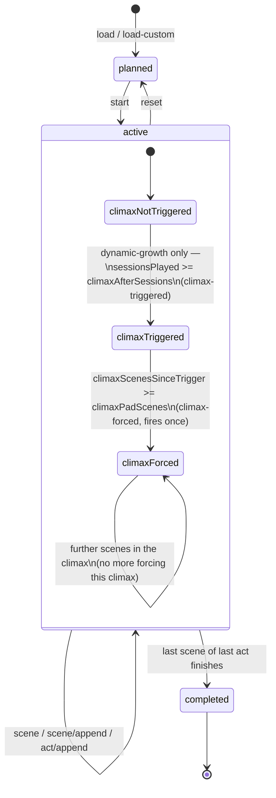

# AI GM Bot – Adventure Module Manual

This manual explains how to load, run, and manage structured adventure modules with the Fate's Edge AI GM Bot. It uses **"The Lantern at Dusk"** (a simple one‑shot tutorial adventure) as the worked example throughout.

You’ll learn:
- How the bot integrates with the server’s adventure engine.
- How to load and start a module.
- How to navigate scenes, timers, encounters, and secrets.
- How to use the bot’s commands and tags to drive the story.

---

## 1. The Big Picture: Bot & Server Integration

The AI GM Bot is a client of the Fate's Edge Socket Server. It connects via WebSocket, claims the GM role, and uses the server’s HTTP API to manage adventure state.

**Key server endpoints (from `server/api.js` and `server/adventure.js`):**
- `GET /api/rooms/:code/adventure` – get current adventure status (acts, scenes, active encounter, timers, plus climax-pacing fields `climaxPadScenes`, `climaxScenesSinceTrigger`, `climaxForced`).
- `POST /api/rooms/:code/adventure/load` – load a module by ID.
- `POST /api/rooms/:code/adventure/start` – transition from `planned` to `active`.
- `POST /api/rooms/:code/adventure/scene` – advance to the next scene (or start the first if none active).
- `POST /api/rooms/:code/adventure/encounter/start` – begin a new encounter.
- `POST /api/rooms/:code/adventure/encounter/resolve` – resolve the active encounter.
- `POST /api/rooms/:code/adventure/timer` – tick a scene or campaign timer.
- `POST /api/rooms/:code/adventure/npc` – add a new NPC to the active adventure.
- `POST /api/rooms/:code/adventure/knowledge/reveal` – mark a secret as revealed.
- `POST /api/rooms/:code/adventure/knowledge/hide` – revert a secret to hidden.
- `POST /api/rooms/:code/adventure/act/append` – append a new act (dynamic growth).
- `POST /api/rooms/:code/adventure/scene/append` – append a new scene to the current act.
- `POST /api/rooms/:code/adventure/climax-triggered` – mark that the climax act has begun.
- `POST /api/rooms/:code/adventure/climax-forced` – mark that a forced climax twist has already been generated and appended (`climaxForced: true`), so this only ever fires once per climax. The bot calls this after appending the twist scene itself, not before — the route records the fact, it doesn't generate anything.
- `POST /api/rooms/:code/adventure/session/end` – increment the session counter (for dynamic‑growth adventures).
- `GET /api/rooms/:code/adventure/reference` – get read‑only NPC/location/faction/bestiary data from the current module, plus (if the module declares one) its `persistence` schema — see "Legacy Tracker" in §4.6 below.
- `GET /api/modules` – list all available modules (adventures) installed on the server.

The bot’s `adventure-director.js` and `adventure-context.js` modules are the glue: they call these endpoints, cache responses, and inject scene context into the LLM’s prompt. The bot also listens for server‑broadcast events (`state-updated`, `crown-spread`, etc.) to keep its local state in sync.

**Adventure status lifecycle**, including the climax-pacing sub-states that only ever apply to dynamic-growth (Crown-Spread-generated) adventures — see [DESIGN.md](DESIGN.md) for the full mechanism:



---

## 2. Adventure Module Structure (JSON)

A module is a JSON file placed in the **server's** `data/adventures/` folder (`fates-edge-socket-server/data/adventures/` — not the bot's own `campaigns/`, which only holds a small session-save pointer file, unrelated to adventure content) or installed via the server's module system (`POST /api/modules`). It has the following top‑level fields (see `lantern_at_dusk.json` for a complete example):

```json
{
  "id": "lantern_at_dusk",
  "title": "The Lantern at Dusk",
  "description": "...",
  "tier": "I",
  "tierRange": "I",
  "author": "...",
  "sessions": "1–2",
  "themes": [...],
  "bestiary": [...],
  "acts": [ { "id": "...", "title": "...", "description": "...", "scenes": [...] } ],
  "npcs": [...],
  "locations": [...],
  "factions": [...],
  "campaignTimers": [...],
  "knowledge": [...],
  "persistence": {
    "schema": "fenwood-legacy-v1",
    "carryover": [ { "key": "millhouse_standing", "type": "dictionary", "default": "unknown" } ],
    "reset_on_complete": false
  },
  "_gmhints": { ... }
}
```

The bot uses:

- **`acts`** – The story’s acts, each containing an array of `scenes`.
- **`scenes`** – Each scene has `title`, `description` (read‑aloud), `timers` (array of timer definitions), and `encounters` (one or more possible encounters for that scene). Encounters can be *skill‑based* (with `dv`, `position`, and `outcomes` for clean/partial/miss) or *creature‑based* (with `creatureId`, `quantity`, `dv`, `position`, `outcomes`).
- **`npcs` / `locations` / `factions`** – Reference data that the bot injects into its prompt.
- **`knowledge`** – Array of secrets with `id`, `gm` (the truth), `player` (what players currently know, often `null`), `revealed` (boolean), and `revealCondition` (guidance for when to reveal). The bot respects `revealed` and will only mention the `gm` text when the secret is revealed.
- **`persistence`** *(optional)* – The Legacy Tracker's declarative schema for carryover state that survives past this adventure's completion (reputations, favors, lingering consequences). `carryover` is an array of `{ key, type?, default?, max? }` objects, not plain key names — see §4.6 below and [DESIGN.md](DESIGN.md) in the bot repo for exactly how each key's value gets populated at finalize-time (a deterministic Facts/timer/default lookup, not an LLM extraction step). This field works the same way for pre-written modules and Crown-Spread-generated adventures alike.
- **Climax pacing** (`climaxPadScenes`, `dynamicGrowth`, `climaxAfterSessions`) is **not** something a pre-written module's JSON file can set — these fields only apply to Crown-Spread-generated adventures, and a pre-written module loaded from the server's `data/adventures/` always runs with growth pacing forced off, regardless of what (if anything) its JSON contains for these keys. See [DESIGN.md](DESIGN.md) §2.1.a/§3.2 if you're curious why.
- **`_gmhints`** – A free‑form object that the bot injects into the LLM prompt as **immutable constraints** – e.g., pacing notes, forbidden early revelations, and NPC secrets. This overrides generic narrative instincts.
- **`campaignTimers`** – Long‑lasting timers that persist across scenes (e.g., the Barrow Collapse timer).

---

## 3. Step‑by‑Step: Running “The Lantern at Dusk”

### 3.1. Load the Adventure

Ensure `lantern_at_dusk.json` is in the server's `data/adventures/` folder (it ships there by default) or otherwise in the server's modules list. Then, in the chat:

```
!gm adventure load lantern_at_dusk
```

The bot replies with a confirmation and shows the current status (planned).

### 3.2. Start the Adventure

```
!gm adventure start
```

The bot begins Act 1, Scene 1 (“The Entry”). It injects the scene’s `description` into its prompt and sets up the **Barrow Collapse** timer (6 segments). It will narrate the entry read‑aloud and wait for player actions.

### 3.3. Scene 1 – The Entry

**What the bot does:**
- It presents the scene description.
- It sees that the scene has one encounter: “Clearing the Rubble” (DV 3, Controlled).
- When a player describes an action (e.g., “I try to move the rubble”), the bot responds with a `[CALL FOR ROLL ...]` or `[ROLL ...]` tag, and the roll is resolved.
- On a **Miss**, it ticks the Barrow Collapse timer (+1) and applies Harm as per the encounter’s `outcomes.miss`.
- On a **Partial**, it ticks the timer but gives a Boon.
- On a **Clean**, the scene advances.

**Teaching moment:** The bot explains Position, DV, and Outcomes as they happen, because the `_gmhints` section tells it to.

### 3.4. Advancing Scenes

When the encounter is resolved, the bot can emit `[SCENE COMPLETE "notes"]` to move on. If it doesn’t, you can manually advance:

```
!gm scene next
```

This calls `POST /api/rooms/:code/adventure/scene` and the bot loads the next scene (Scene 2 – The Spirit Corridor).

### 3.5. Scene 2 – The Spirit Corridor

Here, two encounters are defined: a social one (“Offer a Memory or a Secret”) and a combat one (with Duskwights). The bot may present both as options. Players can choose their approach.

- **Social encounter:** The bot explains that offering a meaningful memory lowers the DV. This is a `Controlled` roll. On Clean, the spirits bow and let them pass. On Partial, they steal a piece of equipment. On Miss, they attack.
- **Combat encounter:** The bot uses the Duskwight creature stats and SB spends. It can `[SPEND SB]` to use “Draining Touch” or “Terrifying Visage”.

The **Barrow Collapse** timer continues ticking on failures.

### 3.6. Scene 3 – The Lantern Chamber

**Quick Lena** appears. This is a social encounter with a rival. The bot can handle negotiation, intimidation, or combat. Outcomes:
- Clean: She leaves peacefully, warning of others.
- Partial: She agrees to split reward, but demands a favour (starts a Debt timer).
- Miss: She triggers a trap, ticking the collapse timer.

Additionally, a second timer **Lena’s Agenda** is present. It ticks at the end of each scene inside the barrow. If it fills before the party resolves this scene, Lena has already taken the lantern – raising the stakes. The bot manages this automatically.

### 3.7. Scene 4 – Escape

A group challenge: the party needs **3 successes before 2 failures** to escape. The bot orchestrates this as a series of rolls; each success counts toward the goal, each failure ticks the collapse timer and gives the party a Boon.

### 3.8. Resolution – Breaking the Curse

After escaping, the party returns the lantern to the stone circle. The bot presents the final ritual encounter (DV 2, Controlled). The outcome determines the epilogue:
- Clean: The blight lifts; Elder Sarai rewards them with a String.
- Partial: The curse lifts, but the lantern cannot be destroyed – it will attract danger again.
- Miss: The curse is only pushed back; a dark spirit escapes and becomes a recurring enemy.

The bot narrates accordingly.

---

## 4. Key Features & Commands

### 4.1. Adventure Lifecycle

| Command | Description |
|---------|-------------|
| `!gm adventure` | Show status / selection menu. |
| `!gm adventure load <id>` | Load a module by ID. |
| `!gm adventure start` | Start the loaded adventure. |
| `!gm adventure reset` | Reset the current adventure to its beginning. |
| `!gm adventure vote abandon` | Start a majority vote to abandon the adventure. |
| `!gm adventure debug` | (GM only) Dump full state and reference data. |

### 4.2. Scene & Timer Control

| Command | Description |
|---------|-------------|
| `!gm scene next` | Advance to the next scene. |
| `!gm timer add <name> <segments> [onFill]` | Add a scene timer. |
| `!gm timer tick <name> [ticks]` | Tick a timer; if filled, event triggers. |
| `!gm timer remove <name>` | Remove a timer. |
| `!gm timer status` | List all active timers. |

**Auto‑tick:** On a **Partial** or **Miss**, the bot automatically ticks the **first** timer of the current scene. This is how the Barrow Collapse advances without manual intervention.

### 4.3. Encounters

| Command | Description |
|---------|-------------|
| `!gm encounter start "<name>" [type]` | Start an encounter (type: combat, obstruction, skill_challenge, trap_ward, lockpick, heist, social). |
| `!gm encounter status` | Show active encounter info. |
| `!gm encounter resolve <outcome> [notes]` | Resolve encounter (outcome: clean, partial, miss). |

The bot also responds to AI‑generated tags: `[ENCOUNTER START ...]` and `[ENCOUNTER RESOLVE ...]`.

### 4.4. Knowledge / Secrets

| Command | Description |
|---------|-------------|
| `!gm knowledge list` | Show all knowledge entries and their revealed status. |
| `!gm knowledge reveal <id>` | Mark a secret as revealed. |
| `!gm knowledge hide <id>` | Revert a revealed secret (correct a mistake). |

The bot also understands `[REVEAL "id"]` and `[HIDE "id"]` tags, which are used by the AI when the story warrants it.

### 4.5. NPC Creation & Token Management

| Command | Description |
|---------|-------------|
| `!gm npc create "Name" ["Role"] ["Motivation"]` | Register an NPC into the adventure. |
| `!gm token place <name> <col> <row> [ally\|enemy]` | Place a token on the whiteboard grid. |
| `!gm token move <name> <col> <row>` | Move a token. |
| `!gm token remove <name>` | Remove a token. |
| `!gm token clear` | Remove all enemy tokens. |

The bot automatically places tokens when it emits `[NPC CREATE ...]` with a role/motivation that suggests faction; you can also do it manually.

### 4.6. Legacy Tracker (Adventure-Specific Carryover)

| Command | Description |
|---------|-------------|
| `!gm adventure legacy` | List every legacy schema with tracked state (GM only). |
| `!gm adventure legacy <schema>` | Show the full carryover values recorded for one schema (GM only). |
| `!gm adventure legacy <schema> set <key> <value>` | Manually override one carryover value (JSON-parsed when possible, else stored as a plain string) (GM only). |
| `!gm adventure legacy <schema> clear` | Wipe an entire schema's legacy entry (GM only). |

An adventure module opts into carryover by declaring a `persistence` block (see §2 above). Its
`schema` id is a stable name shared by any other module meant to read/write the same legacy state
(e.g. a trilogy where module 2 should know what happened in module 1) — modules that don't share a
schema id never see each other's legacy state. When an adventure completes, `legacy-tracker.js`
extracts the values described by the schema and writes them into a small in-memory legacy store
(capped to the most recent few schemas, oldest evicted first); when a later adventure declaring the
same schema starts, those values are folded into the AI's system prompt so it can reference past
consequences without needing the old transcript. `reset_on_complete: true` in the schema clears the
entry instead of writing it — useful for a one-shot flag that should only ever apply to the very
next adventure. See [DESIGN.md](DESIGN.md) in the bot repo for the full mechanism.

---

## 5. Troubleshooting

- **Adventure not loading** – Verify the module ID is correct. Use `!gm adventure` to see the selection menu and preview options.
- **Bot seems stuck** – Use `!gm scene next` to force advancement, or `!gm adventure reset` to restart.
- **Knowledge not revealing** – Check `!gm knowledge list` to see if the entry is already revealed; if not, manually reveal it.
- **Timers not ticking** – Ensure the bot has the correct timer name (use `!gm timer status`). On Partial/Miss, the bot ticks the **first** timer of the current scene. Rename timers to control which one ticks.
- **Dashboard** – Open `http://localhost:4141` to see live state, token usage, and the AI’s memory.
- **Whiteboard tokens** – If tokens don’t appear, ensure the grid is enabled (`!gm grid` to check). The bot can place tokens via `[TOKEN MOVE ...]` and `[TOKEN REMOVE ...]` tags.

---

# MANPAGE

**AI-GM-BOT-ADVENTURE(7)**  
Fate’s Edge AI GM Bot – Adventure Module Manual

## NAME

ai-gm-bot-adventure – using structured adventures with the AI GM Bot

## SYNOPSIS

**!gm adventure** [*subcommand*]  
**!gm scene** [*subcommand*]  
**!gm timer** [*subcommand*]  
**!gm encounter** [*subcommand*]  
**!gm knowledge** [*subcommand*]  
**!gm adventure legacy** [*schema*] [*set <key> <value>|clear*]

## DESCRIPTION

The AI GM Bot can load and run structured adventure modules defined in JSON format. Adventures contain acts, scenes, timers, encounters, NPCs, and knowledge secrets. This manual explains how to manage them, using the included “Lantern at Dusk” tutorial adventure as a worked example.

## ADVENTURE STATES

- **planned** – Module loaded but not yet started.
- **active** – Currently in progress.
- **completed** – Finished; can be reset.

## COMMANDS

### Adventure Management

**`!gm adventure`**  
Show status of the current adventure, or a selection menu if none loaded.

**`!gm adventure load <id>`**  
Load an adventure module by ID (e.g., `lantern_at_dusk`).

**`!gm adventure start`**  
Begin the loaded adventure.

**`!gm adventure reset`**  
Restart the current adventure from the beginning.

**`!gm adventure vote abandon`**  
Start a vote to abandon the current adventure; majority wins.

**`!gm adventure debug`**  
(GM only) Dump full state and reference data (NPCs, locations, bestiary, etc.) to chat.

### Scene & Timer Control

**`!gm scene next`**  
Manually advance to the next scene.

**`!gm timer add <name> <segments> [onFill]`**  
Add a scene timer.

**`!gm timer tick <name> [ticks]`**  
Tick a timer; if filled, the event triggers.

**`!gm timer remove <name>`**  
Remove a timer.

**`!gm timer status`**  
List all active timers.

### Encounters

**`!gm encounter start "<name>" [type]`**  
Start an encounter (type: combat, obstruction, skill_challenge, trap_ward, lockpick, heist, social; defaults to combat).

**`!gm encounter status`**  
Show active encounter info (name, type, DV, position).

**`!gm encounter resolve <outcome> [notes]`**  
Resolve the current encounter (outcome: clean, partial, miss).

### Knowledge (Secrets)

**`!gm knowledge list`**  
Show all knowledge entries and their revealed status.

**`!gm knowledge reveal <id>`**  
Mark a secret as revealed (safe to share with players).

**`!gm knowledge hide <id>`**  
Revert a revealed secret (correct a mistake).

### NPC & Token Management

**`!gm npc create "Name" ["Role"] ["Motivation"]`**  
Register an NPC into the current adventure.

**`!gm token place <name> <col> <row> [ally|enemy]`**  
Place a token on the whiteboard grid.

**`!gm token move <name> <col> <row>`**  
Move an existing token.

**`!gm token remove <name>`**  
Remove a token.

**`!gm token clear`**  
Remove all enemy tokens.

### Legacy / Carryover

**`!gm adventure legacy`**  
List every legacy schema with tracked carryover state.

**`!gm adventure legacy <schema>`**  
Show the full carryover values recorded for one schema.

**`!gm adventure legacy <schema> set <key> <value>`**  
Manually override one carryover value.

**`!gm adventure legacy <schema> clear`**  
Wipe an entire schema's legacy entry.

## WORKED EXAMPLE: THE LANTERN AT DUSK

1. **Load the module:**  
   `!gm adventure load lantern_at_dusk`

2. **Start the adventure:**  
   `!gm adventure start`

3. **Play through scenes:**  
   The bot narrates each scene. On a **Partial** or **Miss**, the **Barrow Collapse** timer ticks automatically.  
   Use `!gm scene next` if the bot doesn’t advance.

4. **Manage encounters:**  
   The bot will call for rolls; you can also start/resolve encounters manually using `!gm encounter ...`.

5. **Reveal secrets:**  
   When a secret is earned, use `!gm knowledge reveal <id>` so the bot can mention it.

6. **End the adventure:**  
   After the final scene, the bot marks the adventure as completed and archives a summary.

## TROUBLESHOOTING

- **Adventure not loading** – Check the module ID. Use `!gm adventure` to see the selection menu.
- **Bot seems stuck** – Force a scene advance with `!gm scene next`.
- **Timer not ticking** – The bot ticks the **first** scene timer on Partial/Miss. Rename timers to control which one advances.
- **Knowledge not revealing** – Check status with `!gm knowledge list` and manually reveal if needed.
- **Tokens missing** – Ensure the grid is enabled (`!gm grid`). The bot places tokens via `[TOKEN MOVE ...]` tags.

## FILES

- **`fates-edge-socket-server/data/adventures/*.json`** – the actual adventure module files the server loads and runs (`ADVENTURES_DIR` in `server/adventure.js`). This is on the **server**, not the bot.
- `data/adventures/manifest.json` (bot-local) – maps module ids to their full-text doc HTML for `adventure-context.js`'s `getAdventureDoc()`; doesn't drive what the server can load.
- `campaigns/{ROOM}_code.txt` (bot-local) – **not** adventure content — the bot's own auto-save short-code pointer for `!gm upload`/`!gm load <code>` session persistence (`world-manager.js`'s `CampaignManager`).
- `server/adventure.js` – Server-side adventure engine.
- `modules/adventure-director.js`, `modules/adventure-context.js` – Bot integration.
- `modules/legacy-tracker.js` – Legacy Tracker (adventure-specific carryover); see [DESIGN.md](DESIGN.md).
